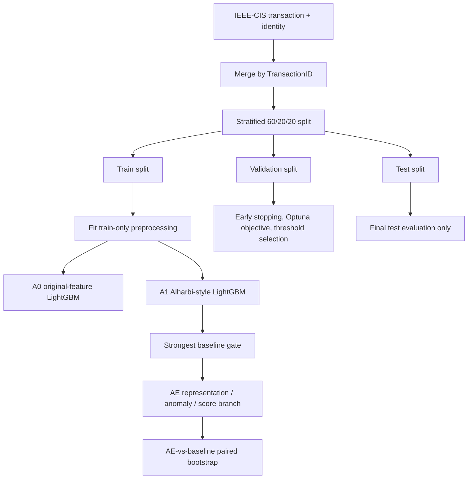

# Bab 3 Method Adjustment

Status: active reset outline, not yet inserted into the DOCX.

Purpose: align Bab 3 with the active stratified, paper-anchored experiment
protocol. Historical chronological results must not be used as Bab 3 final
candidate claims.

## Recommended Method Name

Use a descriptive working name:

```text
Paper-Anchored Stratified Evaluation of LightGBM and Autoencoder-LightGBM
```

Short label for tables:

```text
Stratified LGBM / AE-LGBM
```

## Research Flow

1. Load IEEE-CIS `train_transaction` and `train_identity`.
2. Merge on `TransactionID`.
3. Split with stratified 60/20/20 train, validation, and test holdout.
4. Fit every preprocessing object on the training split only.
5. Train A0 original-feature LightGBM.
6. Tune A0 with Optuna on validation PR-AUC.
7. Train A1 Alharbi-style preprocessing LightGBM.
8. Tune A1 with the same Optuna protocol.
9. Train AE / AE-LightGBM variants only after the strongest A1 baseline exists.
10. Evaluate with PR-AUC/AP as primary metric, plus ROC-AUC, F1, MCC, and
    confusion matrix as supporting evidence.
11. Use paired bootstrap on the same test rows for any promoted AE-vs-baseline
    AP delta.

## Pipeline Diagram



## Data Splitting Protocol

The active thesis experiment uses:

```text
split_strategy=stratified_holdout
train/validation/test = 60/20/20
random_state = 42
```

Rationale:

- Class proportions should remain stable under severe imbalance.
- Several IEEE-CIS related papers use random/stratified evaluation or do not
  expose a strict temporal split.
- Temporal and concept drift are still important, but they are discussed as
  limitation/future work rather than the main S1 protocol.

Implementation anchors:

- `src/splitting.py`
- `docs/STRATIFIED_SPLIT_RESET.md`

## Preprocessing Design

### A0 Original-Feature Baseline

A0 keeps the original IEEE-CIS features after dropping `TransactionID`.

- Categorical values are mapped using train-fitted integer mappings.
- Missing categoricals become `__MISSING__`.
- Unseen validation/test categories become `-1`.
- Numeric missing values remain `NaN` for LightGBM native missing handling.

Implementation:

```text
src/preprocessing.py
src/train_baseline_lgbm.py
```

### A1 Alharbi-Style Baseline

A1 is the main paper-anchored preprocessing branch.

- Categorical missing values become a dedicated missing category.
- Categorical values are train-frequency encoded.
- Unseen validation/test categories map to frequency 0.
- Numeric missing values are imputed with train medians.
- Numeric values are z-score scaled using train means and standard deviations.
- No target encoding.
- No SMOTE/ADASYN before split.

Implementation:

```text
src/paper_preprocessing.py
src/train_paper_preprocessing_lgbm.py
src/tune_lgbm_optuna.py --model_type alharbi_lgbm
```

Literature anchors:

- Alharbi et al. (2026): IEEE-CIS preprocessing with frequency encoding,
  missing handling, numeric imputation/scaling, and AE-family context.
- Kabane & Ouali (2024): leakage warning for inappropriate preprocessing or
  sampling before split.

## Autoencoder Component

AE variants are tested after the strongest A1 baseline is known.

Allowed AE roles:

- compact representation of anonymized numerical `V*` features;
- reconstruction/anomaly signal;
- complementary score-level signal.

Claims to avoid:

- AE replaces all tabular evidence.
- AE is promoted before beating the strongest matched baseline.
- AE results from chronological runs are treated as active stratified evidence.

Implementation anchors:

- `src/train_autoencoder_robust.py`
- `src/train_autoencoder_normal_masked.py`
- `src/train_ae_lgbm.py`
- `src/train_score_ensemble.py`

Literature anchors:

- Jiang et al. (2023): AE anomaly framing on IEEE-CIS.
- Vincent et al. (2010): denoising AE representation learning.
- Ding et al. (2024) and Du et al. (2023): AE + LightGBM hybrid precedent.

## Evaluation Metrics

Primary metric:

- Average Precision / PR-AUC.

Supporting metrics:

- ROC-AUC.
- F1.
- MCC.
- Confusion matrix at validation-selected threshold.

Rationale:

- IEEE-CIS is highly imbalanced.
- PR-AUC is more informative for minority-class ranking than accuracy or ROC
  alone.

Literature anchors:

- Saito & Rehmsmeier (2015).
- Davis & Goadrich (2006), if included in the final reference list.

## Decision Gates

Preprocessing branch:

- Promote A1 only if it improves or clarifies the strongest A0 baseline under
  the same stratified test split.

AE branch:

- Promote only if test AP beats the strongest matched A1 baseline.
- Require paired-bootstrap AP delta with a positive confidence interval.
- Record the result in `docs/EXPERIMENT_REGISTRY.md`.

## Thesis Claim Boundary

Safe claim before rerun:

```text
The thesis evaluates whether Autoencoder-derived representation or anomaly
signals improve a strong paper-anchored LightGBM baseline under a leakage-safe
stratified protocol.
```

Only after rerun may Bab 4/5 state whether AE wins.

## Historical Notes

Chronological P01-P04, AE-05, preprocessing-ablation, and score-ensemble results
remain useful for motivation and audit trail, but they are not active Bab 3
method claims after the reset. Cite them only as "under the previous
chronological protocol" and keep them separate from stratified result tables.
