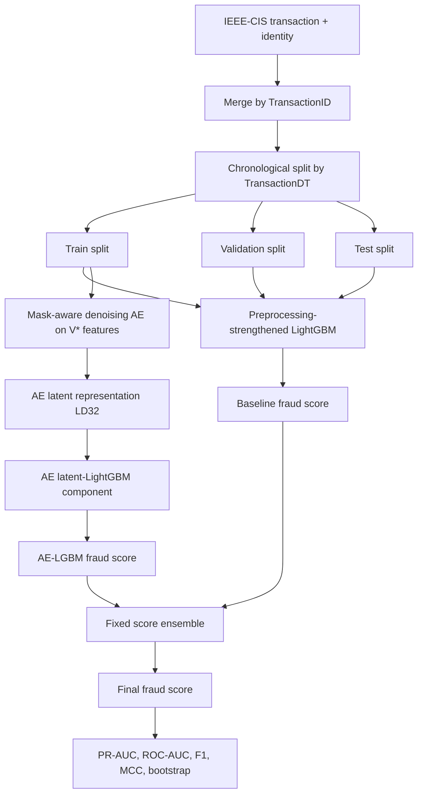

# Bab 3 Method Adjustment

Status: working draft for thesis alignment, not yet inserted into the DOCX.

Purpose: align Bab 3 with the current evidence-backed candidate without changing the thesis title. The method should be framed as an Autoencoder-LightGBM fraud detection pipeline where the Autoencoder contributes a complementary latent score, not as a full replacement for tabular LightGBM features.

## Recommended Method Name

Use a descriptive, defensible name:

```text
Fixed Score-Level Ensemble of Preprocessing-Strengthened LightGBM and Mask-Aware Autoencoder-LightGBM
```

Short label for tables:

```text
LGBM + AE-LGBM Score Ensemble
```

## Research Flow

1. Load IEEE-CIS `transaction` and `identity` data.
2. Merge on `TransactionID`.
3. Sort by `TransactionDT`.
4. Split chronologically into train, validation, and test.
5. Build preprocessing-strengthened LightGBM baseline.
6. Train mask-aware denoising Autoencoder on `V*` features.
7. Train AE latent-LightGBM component.
8. Combine baseline and AE component scores with fixed equal weight.
9. Evaluate using PR-AUC/AP as primary metric, with ROC-AUC, F1, and MCC as supporting metrics.
10. Test significance using paired bootstrap on test-set PR-AUC delta.

## Pipeline Diagram



## Data Splitting Protocol

The dataset must be split chronologically using `TransactionDT`, not random split.

Rationale:

- Fraud detection data can experience temporal population shift.
- Random split can overestimate performance because future-like patterns may leak into training.
- The thesis therefore uses train/validation/test splits ordered by transaction time.

Literature anchors:

- Dal Pozzolo et al. (2018): realistic fraud detection evaluation.
- Lucas et al. (2019): transaction populations shift over time.
- Kabane & Ouali (2024): warns against leakage and inflated metrics from inappropriate preprocessing/sampling protocols.

Implementation anchor:

- `src/splitting.py`
- `docs/THESIS_SCOPE.md`
- `docs/EXPERIMENT_REGISTRY.md`

## Preprocessing Design

The baseline component uses literature-aligned preprocessing:

- Train-only categorical frequency/count encoding for selected high-cardinality fields.
- Compact missingness summaries by feature families.
- Time features derived from `TransactionDT`.
- Amount features from `TransactionAmt`.
- Numeric missing values remain `NaN` for LightGBM native missing handling.
- No SMOTE/ADASYN before split.
- No target encoding.
- No fitting encoders or scalers on validation/test data.

Literature anchors:

- Moradi et al. (2025): IEEE-CIS performance is strongly influenced by feature engineering and ensemble-style modeling.
- Alharbi et al. (2026): IEEE-CIS preprocessing includes explicit missing handling and categorical frequency encoding.
- Kabane & Ouali (2024): avoid pre-split resampling leakage.

Implementation anchor:

- `src/enhanced_preprocessing.py`
- `src/train_enhanced_preprocessing_lgbm.py`

Artifact anchor:

```text
outputs/initial_proposal/preprocessing_ablation/baseline_frequency_missingness_time_amount_fixed_p02/
```

## Baseline LightGBM Component

The baseline model is LightGBM trained on the preprocessing-strengthened tabular features.

Role in thesis:

- Main supervised tabular classifier.
- Provides the strongest single-model baseline.
- Its score becomes one input to the final fixed score ensemble.

Literature anchors:

- Ke et al. (2017): LightGBM as efficient gradient boosting for large tabular data.
- Moradi et al. (2025): LightGBM/XGBoost/RF family is strong for IEEE-CIS-style fraud modeling.

Empirical anchor:

| Model | Test AP | Test ROC-AUC | Test F1 | Test MCC |
|-------|---------|--------------|---------|----------|
| Best preprocessing baseline | 0.524197 | 0.899850 | 0.513185 | 0.523469 |

## Autoencoder Component

The Autoencoder component is not used to replace all raw tabular evidence. It learns a compact representation from `V*` features, then a separate LightGBM component produces an AE-informed fraud score.

Final AE representation:

- Input values: median-imputed and standardized `V*` features.
- Mask-aware input: observed-cell mask appended to value inputs.
- Denoising: light Gaussian noise applied only to scaled values, not masks.
- Latent dimension: 32.
- Training subset: all chronological train rows.
- Target use: no `isFraud` label is used for AE fitting.

Literature anchors:

- Jiang et al. (2023): AE-based representation/reconstruction distance can act as anomaly signal in IEEE-CIS fraud detection.
- Vincent et al. (2010): denoising Autoencoders learn robust representations from corrupted inputs.
- Alharbi et al. (2026): AE latent spaces are used in IEEE-CIS-oriented hybrid fraud systems, with explicit missing handling.
- Ding et al. (2024) and Du et al. (2023): precedent for integrating AE representations with LightGBM in fraud detection.

Implementation anchor:

- `src/train_autoencoder_normal_masked.py`
- `src/train_enhanced_preprocessing_lgbm.py --model-type baseline_latent`

Artifact anchors:

```text
outputs/initial_proposal/all_masked_autoencoder_ld32/
outputs/initial_proposal/preprocessing_ablation/baseline_latent_all_masked_ld32_frequency_missingness_time_amount_fixed_p02/
```

Empirical anchor:

| Model | Test AP | Test ROC-AUC | Test F1 | Test MCC |
|-------|---------|--------------|---------|----------|
| AE all-mask LD32 latent add-on | 0.523783 | 0.898913 | 0.507131 | 0.515228 |

## Fixed Score-Level Ensemble

The final candidate combines the baseline component score and AE latent-LightGBM component score:

```text
score_final = 0.5 * score_baseline + 0.5 * score_AE-LGBM
```

Rationale:

- The baseline component captures strong engineered tabular patterns.
- The AE component contributes a related but not identical latent representation signal.
- Equal weighting is intentionally simple, reproducible, and less prone to overfitting than selecting a highly optimized weight.

Literature anchors:

- Moradi et al. (2025): ensemble-style integration is a credible modeling pattern in IEEE-CIS fraud detection.
- Jiang et al. (2023): AE-derived representation/anomaly signals can complement downstream detection.
- Ding et al. (2024) and Du et al. (2023): hybrid AE + LightGBM framing.

Implementation anchor:

- `src/train_score_ensemble.py`

Artifact anchor:

```text
outputs/initial_proposal/preprocessing_ablation/score_ensemble_baseline_all_masked_ld32_fixed_050_canonical/
```

Empirical anchor:

| Model | Test AP | Test ROC-AUC | Test F1 | Test MCC |
|-------|---------|--------------|---------|----------|
| Best preprocessing baseline | 0.524197 | 0.899850 | 0.513185 | 0.523469 |
| Fixed 0.50 score ensemble | **0.529114** | **0.902288** | **0.515423** | 0.520584 |

## Evaluation Metrics

Primary metric:

- Average Precision / PR-AUC.

Supporting metrics:

- ROC-AUC.
- F1.
- MCC.
- Confusion matrix at validation-selected threshold.

Rationale:

- IEEE-CIS fraud detection is highly imbalanced.
- PR-AUC is more sensitive to minority-class ranking quality than accuracy.
- F1 and MCC are retained to show threshold-dependent classification tradeoffs.

Literature anchors:

- Saito & Rehmsmeier (2015): PR curves are more informative than ROC curves under class imbalance.
- Davis & Goadrich (2006): relationship between ROC and PR curves.

Implementation anchor:

- `src/evaluation.py`

## Significance Testing

The final candidate is compared against the strongest baseline using paired bootstrap on test-set PR-AUC.

Final result:

| Candidate | Baseline AP | Candidate AP | Delta AP | 95% CI | p(delta <= 0) |
|-----------|-------------|--------------|----------|--------|---------------|
| Fixed 0.50 score ensemble | 0.524197 | 0.529114 | +0.004917 | [+0.003177, +0.006720] | 0.0000 |

Rationale:

- The same test rows are scored by both models.
- Paired bootstrap estimates whether the PR-AUC improvement is stable under row resampling.

Artifact anchor:

```text
outputs/initial_proposal/preprocessing_ablation/score_ensemble_baseline_all_masked_ld32_fixed_050_canonical/paired_bootstrap_summary.json
```

## Robustness Checks

Manual alpha checks:

| AE score weight | Test AP | Delta AP vs baseline | 95% CI |
|-----------------|---------|----------------------|--------|
| 0.25 | 0.528179 | +0.003982 | [+0.003025, +0.004957] |
| **0.50** | **0.529114** | **+0.004917** | [+0.003177, +0.006720] |
| 0.75 | 0.527575 | +0.003378 | [+0.000799, +0.005911] |
| tuned 10 trials | 0.528975 | +0.004778 | [+0.003407, +0.006165] |

Interpretation:

- The final conclusion does not depend on a fragile single alpha value.
- Fixed 0.50 is best by test PR-AUC.
- Tuned alpha improves validation AP but does not improve test AP over fixed 0.50, so fixed 0.50 is preferred.

## Thesis Claim Boundary

Recommended claim:

```text
The Autoencoder improves fraud detection when used as a complementary score-level signal to a preprocessing-strengthened LightGBM baseline.
```

Claims to avoid:

- "Autoencoder replaces LightGBM."
- "Latent replacement is better than raw tabular features."
- "The method is directly comparable to papers using random split or SMOTE."
- "AE reconstruction error alone is the key improvement."

## Bab 4 / Bab 5 Framing Notes

Bab 4 should show the experimental progression:

1. Historical P01-P04 results: latent replacement did not beat tuned LightGBM.
2. Literature-aligned preprocessing improves the baseline.
3. Direct AE reconstruction and latent augmentation are close but not enough.
4. Fixed score-level integration gives a statistically significant AP improvement.

Bab 5 should conclude carefully:

- The best final result is achieved by combining LightGBM and AE-LGBM scores.
- AE contributes complementary representation information.
- The improvement is modest but statistically stable.
- The result supports the thesis direction without overstating AE as a standalone replacement.

## Reproducibility Checklist

Required scripts:

- `src/train_enhanced_preprocessing_lgbm.py`
- `src/train_autoencoder_normal_masked.py`
- `src/train_score_ensemble.py`

Required final artifacts:

- `outputs/initial_proposal/preprocessing_ablation/final_candidate_comparison.csv`
- `outputs/initial_proposal/preprocessing_ablation/score_ensemble_baseline_all_masked_ld32_fixed_050_canonical/run_config.json`
- `outputs/initial_proposal/preprocessing_ablation/score_ensemble_baseline_all_masked_ld32_fixed_050_canonical/paired_bootstrap_summary.json`
- `outputs/initial_proposal/preprocessing_ablation/score_ensemble_baseline_all_masked_ld32_diagnostics/score_complementarity_summary.json`

Source-of-truth docs:

- `docs/THESIS_SCOPE.md`
- `docs/FINAL_CANDIDATE_VALIDATION.md`
- `docs/EXPERIMENT_REGISTRY.md`

