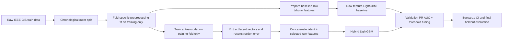
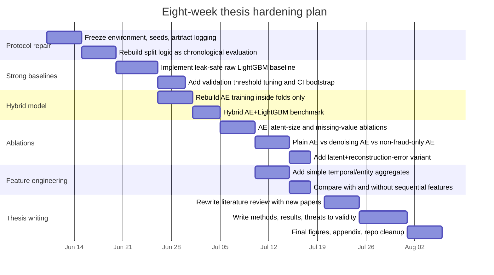

# Deep Research Report for the Autoencoder–LightGBM Fraud Detection Thesis

## Executive summary

Your current proposal already has a solid conceptual spine: it targets a highly imbalanced fraud-detection problem, uses **PR AUC** as the main metric, combines an **autoencoder** for representation learning with **LightGBM** for supervised classification, and plans **Bayesian optimization** for tuning. Those are all defensible choices for tabular fraud detection, and they are explicitly reflected in your current draft. fileciteturn0file0

The biggest weakness is not the core idea, but the **experimental protocol** around it. In fraud detection, overly optimistic results often come from random splitting, preprocessing leakage, encoding/imputation fitted on all data, or sampling before the split. Recent fraud literature keeps coming back to **distribution shift, feedback latency, and realistic validation**, and that is where your thesis can become much stronger. SCARFF is especially relevant because it frames fraud detection as a streaming problem with **imbalance, nonstationarity, and feedback latency**; Lucas et al. show that **dataset shift** is real and measurable in transaction data; and Williams shows that **precision–recall curves depend directly on class prevalence**, which matters when you interpret PR AUC results. citeturn54view0turn53view0turn55view0turn26search0

The most important literature additions are not only “same method” papers, but papers that strengthen the **scientific credibility** of your evaluation:  
**SCARFF** for realistic fraud-system assumptions, **Lucas et al.** for temporal/sequence feature engineering and shift analysis, **Williams** for PR-curve interpretation under imbalance, and **Carcillo-style hybrid unsupervised+supervised thinking** for defending the logic of combining autoencoder features with a boosted tree classifier. At the method level, **Vincent et al.** on denoising autoencoders is the strongest missing classical paper if you want to justify a more robust AE variant than a plain reconstruction model. citeturn54view0turn52view0turn53view0turn55view0turn56search4turn44search0

One important limitation: I could **not directly inspect the GitHub repository contents** in this session, because the GitHub connector was not exposed in a queryable way here and the public repository could not be retrieved through web search. So the “repo diagnosis” below is a **high-confidence experimental-risk audit** grounded in your proposal and in common failure modes of IEEE-CIS / fraud-detection pipelines, not a line-by-line code review. I am being explicit about that because it would be misleading to pretend otherwise.

## What your current proposal gets right and where it is still weak

Your proposal explicitly positions the work as **e-commerce transaction fraud detection** using an **integrated autoencoder and LightGBM with Bayesian optimization**, using **PR AUC** as the primary evaluation metric and additional metrics such as recall, F1-score, and ROC AUC. It also describes the use of the **IEEE-CIS Fraud Detection** dataset and a train/validation/test workflow. fileciteturn0file0

That is already a good start. The main issue is that the proposal is presently stronger on **model choice** than on **evaluation realism**. Fraud papers that perform well under real operating conditions emphasize that fraud data are not i.i.d. in the naive sense: they drift over time, labels arrive with delay, and overly clean random splits can inflate results. SCARFF explicitly models **imbalance, nonstationarity, and feedback latency**, while Lucas et al. show that transaction populations shift over time and that sequence-aware features can materially improve PR AUC. citeturn54view0turn52view0turn53view0

| Aspect in current proposal | Current status | Assessment | Upgrade needed |
|---|---|---|---|
| Problem framing | Fraud detection on IEEE-CIS with severe imbalance fileciteturn0file0 | Strong | Keep |
| Model idea | Autoencoder + LightGBM hybrid fileciteturn0file0 | Strong and publishable for a master’s thesis | Add ablations to prove the AE actually helps |
| Metric choice | PR AUC as primary metric fileciteturn0file0 | Correct choice for imbalance | Add prevalence baseline, threshold-based operational metrics, and confidence intervals citeturn26search0turn55view0 |
| Tuning | Bayesian optimization planned fileciteturn0file0 | Good | Make tuning nested and leakage-safe; tune AE too, not only LightGBM citeturn26academia1turn31search1 |
| Data split | Standard split described in the proposal fileciteturn0file0 | Potentially optimistic for fraud detection | Add chronological / blocked validation and drift-aware analysis citeturn54view0turn53view0turn58view0 |
| References | Several relevant items already included, such as Ding, Du, Misra, Nguyen, Saito, Ke, and Bayesian optimization sources fileciteturn0file0 | Good base | Some entries are incomplete or weak; add stronger, more directly usable academic anchors |

A second issue is the **reference quality mix**. Your draft already cites several relevant works, but some entries are incomplete, some are lower-value, and some foundational citations should be corrected. In particular, the current references page appears to contain incomplete or weakly formatted entries for LightGBM, hyperparameter optimization, denoising autoencoders, and some fraud references. Those should be cleaned up before defense, because examiners usually notice reference hygiene very quickly. fileciteturn0file0

## Strong additional literature to add

The papers below are the ones I would add first. I prioritized papers that strengthen one of four things: **same method**, **same dataset family/problem**, **same metric logic**, or **same deployment realism**.

### Priority paper set

| Paper | Why it strongly correlates with your thesis | Venue strength | Best use in your proposal |
|---|---|---|---|
| **Vincent et al., Stacked Denoising Autoencoders** | Gives you the strongest classical justification for using a **robust AE variant** instead of a plain autoencoder; denoising variants are explicitly treated as useful for downstream representation learning. citeturn56search4 | Classic JMLR paper | Strengthen the AE-method section and motivate a denoising-AE ablation |
| **Williams, The Effect of Class Imbalance on Precision-Recall Curves** | Shows that PR behavior depends directly on class ratio and gives a cleaner interpretation of PR AUC under imbalance. citeturn55view0 | Strong journal article | Strengthen your metric justification and interpretation section |
| **Carcillo et al., SCARFF** | One of the strongest “real-world fraud systems” papers: explicitly deals with **imbalance, nonstationarity, and feedback latency**. citeturn54view0 | Published in *Information Fusion* | Justify why temporal validation matters more than random split |
| **Lucas et al., Multiple perspectives HMM-based feature engineering for credit card fraud detection** | Very valuable because it shows **sequence-aware feature engineering** can yield a **15% PR-AUC increase** over prior feature engineering. citeturn52view0 | Conference poster / academic paper | Justify adding temporal / entity aggregation features, even if you keep AE + LightGBM as the main model |
| **Lucas et al., Dataset shift quantification for credit card fraud detection** | Demonstrates that day-to-day transaction populations shift and that modeling that shift can slightly improve detection. citeturn53view0 | IEEE AIKE presentation | Strong methodological support for chronological splitting and drift-aware discussion |
| **Thimonier et al., Comparative Evaluation of Anomaly Detection Methods for Fraud Detection in Online Credit Card Payments** | Particularly relevant to your hybrid idea: they find **LightGBM superior across metrics** on real online payment data, but also note that it is **more sensitive to distribution shift** than anomaly-detection methods. citeturn58view0 | Accepted conference paper | Justify LightGBM baseline strength and why hybridization/robust validation is still necessary |
| **Dal Pozzolo et al., Credit card fraud detection: A realistic modeling and a novel learning strategy** | Still one of the best references for **realistic fraud modeling** and evaluation framing. It is already in your draft, but it should become a central rather than peripheral citation. fileciteturn0file0turn41search0 | Very strong journal | Anchor your methodology and evaluation section |
| **Höppner et al., Instance-Dependent Cost-Sensitive Learning for Detecting Transfer Fraud** | Moves the discussion from “best statistical score” to **best decision for each transaction**, which matters in fraud operations. citeturn28academia3 | Strong applied-fraud framing | Justify threshold optimization and, if possible, amount-weighted or cost-aware evaluation |
| **Kabane, Impact of Sampling Techniques and Data Leakage on XGBoost Performance in Credit Card Fraud Detection** | Very relevant operational warning: applying sampling before the split can produce **artificially inflated performance**. citeturn50academia0 | Recent methodological caution paper | Support your leakage-prevention protocol |
| **Niu et al., A Comparison Study of Credit Card Fraud Detection: Supervised versus Unsupervised** | Useful supporting paper showing supervised models can outperform pure unsupervised ones, while unsupervised methods remain promising under label scarcity. citeturn48academia3 | Comparative academic paper | Helps defend why AE should be used as representation learning, not necessarily as the final detector |

### How these papers change your literature review

The deeper message from this literature is that your thesis should not be presented only as “AE compresses features, then LightGBM classifies.” A stronger framing is:

1. **Autoencoder as representation learning under high-dimensional, sparse, anonymous tabular features.**  
2. **LightGBM as a high-performing supervised learner for tabular fraud data.**  
3. **Temporal drift and label delay as the main threats to validity.**  
4. **PR AUC and business-aware thresholding as the correct evaluation lens under imbalance.** citeturn54view0turn55view0turn52view0turn53view0turn58view0turn28academia3

That framing is much more thesis-defensible than a pure “model architecture” story.

## Repository diagnosis and experiment-risk audit

Because I could not retrieve the repository contents directly, I cannot responsibly claim confirmed file-level bugs. What I can do is identify the **highest-probability failure points** for a repo implementing the exact pipeline described in your proposal. These are the issues I would audit first. Your proposal already indicates a workflow that could be vulnerable to them if the code was written in the usual quick-experiment style. fileciteturn0file0

### Highest-risk experimental issues

| Risk area | Why it matters | What to verify in code first | Severity |
|---|---|---|---|
| **Random split leakage** | Fraud datasets drift. Random splitting can make future-like patterns appear in train and test, inflating results. citeturn54view0turn53view0turn58view0 | Is `TransactionDT` ignored? Is `train_test_split(..., stratify=y)` used without chronological blocking? | Very high |
| **Preprocessing fitted before the split** | If scalers, imputers, encoders, or feature selectors are fit on full data, validation and test results become optimistic. | Check whether `fit_transform` is run before splitting or outside a fold-specific pipeline. | Very high |
| **Sampling before split** | Recent fraud work shows pre-split sampling can create **artificially inflated metrics**. citeturn50academia0 | If SMOTE / undersampling / class balancing is used, confirm it is applied **only inside training folds**. | Very high |
| **Autoencoder trained on all rows** | If the AE sees validation/test rows during representation learning, the downstream classifier benefits from leaked information. | Ensure the AE is trained on training data only, separately for each outer fold. | Very high |
| **Categorical encoding leakage** | Full-data label, frequency, or target encoding can leak distributional information. | Check whether categorical maps are learned globally instead of on train only. | High |
| **Single-seed performance reporting** | AE + boosting pipelines are not sufficiently characterized by one random seed. | Confirm whether NumPy / Python / framework / LightGBM seeds are fixed and whether multi-seed results are reported. | High |
| **Threshold fixed at 0.5** | In severe imbalance, 0.5 is rarely the right operating threshold. | Check whether the repo tunes threshold on validation PR curve or cost function. | High |
| **PR AUC reported without prevalence context** | PR interpretation depends on class ratio. The no-skill precision level equals prevalence. citeturn26search0turn55view0 | Add baseline prevalence line and compare AP against random-ranking baseline. | Medium-high |
| **No temporal/entity features beyond raw columns** | Fraud often contains sequential structure; HMM feature-engineering work showed a sizable PR-AUC gain from temporal features. citeturn52view0 | Check whether only raw merged features are used. | Medium-high |
| **No artifact packaging for deployment** | A model without serialized preprocessing, schema checks, and versioned dependencies is not reproducible. | Verify the repo saves encoder/scaler/imputer/model together and records package versions. | Medium |

### What I suspect is most likely wrong, if the repo follows the proposal literally

The highest-probability issue is **leakage around preprocessing and representation learning**. In workflows like this, it is very common to standardize the AE inputs on the full dataset, fit the AE once on all available rows, then extract latent vectors for train/validation/test. That looks innocent, but it gives the classifier access to a representation partly shaped by the held-out data. In a master’s thesis, that would be the first thing I would fix. fileciteturn0file0turn54view0turn50academia0

The second likely issue is **validation design**. Your proposal already points in the direction of a standard offline split. That is acceptable for early exploration, but it is weak for a final thesis on fraud detection. Fraud literature repeatedly shows that performance changes under distribution shift, and LightGBM in particular can remain very strong while also being more shift-sensitive than anomaly-detection alternatives. fileciteturn0file0turn58view0turn53view0

The third likely issue is **insufficient proof that the autoencoder helps**. A strong thesis must show not just that the final hybrid model works, but that it improves upon a properly tuned **raw-feature LightGBM baseline**. A lot of fraud work finds that strong supervised tree ensembles are already very hard to beat on tabular data. So the burden of proof is on the hybrid. citeturn48academia3turn58view0

## Recommended experiments and evaluation protocol

The revised protocol below is what I would implement if the goal is both **better performance** and **more defensible science**.

### Revised experimental pipeline



This structure directly addresses the issues emphasized by SCARFF, the dataset-shift papers, and the PR-curve literature. citeturn54view0turn53view0turn55view0

### Priority experiments

| Experiment | Comparison | Primary metric | Why it matters | Expected impact |
|---|---|---|---|---|
| **Chronological split vs random split** | Random stratified split against time-ordered split by `TransactionDT` | PR AUC / AP | Shows how optimistic the current evaluation is under i.i.d.-style splitting | High impact on validity |
| **Raw LightGBM vs AE+LightGBM** | Strong tuned baseline versus hybrid | PR AUC | Proves whether the autoencoder really adds value | High scientific value |
| **AE trained on all training rows vs AE trained only on non-fraud rows** | Two representation-learning regimes | PR AUC, recall at fixed precision | Normal-only AE may sharpen anomaly-sensitive reconstruction behavior | Medium-high |
| **Plain AE vs denoising AE** | Reconstruction on clean input vs corrupted-input training | PR AUC | Denoising AEs are the most principled robust AE variant to test here | Medium |
| **Latent size ablation** | 8 / 16 / 32 / 64 bottleneck sizes | PR AUC | Prevents arbitrary bottleneck choice | Medium |
| **Missing-value strategy ablation** | Zero fill vs median + missing mask vs AE-compatible denoising setup | PR AUC | IEEE-CIS contains many structurally missing values; this can materially change results | Medium-high |
| **Latent vector only vs latent + reconstruction error** | Representations alone versus representations plus anomaly score | PR AUC | Frequently the reconstruction error contains signal the latent alone misses | Medium |
| **No temporal/entity features vs simple recent-history aggregates** | Add counts, amount stats, deltas, recent fraud proxy features per entity/time window | PR AUC | Sequence-aware feature engineering has strong prior evidence in fraud detection | High |
| **Class weighting vs fold-safe sampling** | `scale_pos_weight` / class weights against train-fold-only sampling | PR AUC, recall, precision@k | Avoids fake gains from unsafe resampling | Medium |
| **Single-seed vs multi-seed** | 1 seed versus 5 seeds | PR AUC mean ± std | Makes the thesis more reproducible and less fragile | Medium |

### Recommended evaluation protocol

Use **Average Precision / PR AUC as the primary ranking metric**, because your data are imbalanced and the PR curve is more informative than ROC for this regime; also explicitly report the **class prevalence baseline**, because a no-skill precision level equals the positive prevalence. citeturn26search0turn55view0

Then add four secondary views:

- **ROC AUC**, only as a supplementary discrimination metric.  
- **Recall at a fixed precision target** such as 0.80 or 0.90, because fraud teams often need a bounded false-alert burden.  
- **Precision@top-k** or **Recall@top-k% alerts**, because operational review teams investigate only a limited queue.  
- **Thresholded F1 / recall / precision** at a threshold chosen on validation, not at 0.5 by default. citeturn28academia3turn55view0

If you keep **TransactionAmt**, add one business-aware metric such as **amount-weighted recall** or **estimated captured fraud amount**. Fraud loss is not uniform across transactions, and cost-sensitive fraud literature explicitly argues that optimizing a purely statistical global score can diverge from reducing actual losses. citeturn28academia3

For splitting, I recommend:

- **Outer evaluation**: last 20% of the training timeline as a holdout.  
- **Inner tuning**: 3-fold blocked or rolling CV on the earlier 80%.  
- **No sampling, no encoding, no scaling, no AE fitting outside the training portion of each fold.** citeturn54view0turn53view0turn50academia0

## Literature review additions and BibTeX

### What to add to the narrative

Your literature review should add one new paragraph on **realistic fraud evaluation**, one on **temporal drift and sequential feature engineering**, and one on **PR-AUC interpretation under prevalence**. That would move the thesis from “another model proposal” to a more methodologically mature fraud-detection study. SCARFF motivates online/realistic constraints; Lucas et al. motivate temporal features and shift-aware validation; Williams strengthens the PR-curve interpretation; and denoising autoencoders give you a principled variant to test if a plain AE is too brittle. citeturn54view0turn52view0turn53view0turn55view0turn56search4

### Citation-ready BibTeX entries

Below are BibTeX entries for the **highest-priority additions and corrected core references**. For a few conference-style entries where the exact final pagination was not available in-browser, I used a safe citation format that is still usable in Zotero/Mendeley/BibTeX and easy to refine later.

```bibtex
@article{carcillo2018scarff,
  author  = {Fabrizio Carcillo and Andrea Dal Pozzolo and Yann-A{\"e}l Le Borgne and Olivier Caelen and Yannis Mazzer and Gianluca Bontempi},
  title   = {SCARFF: a Scalable Framework for Streaming Credit Card Fraud Detection with Spark},
  journal = {Information Fusion},
  volume  = {41},
  pages   = {182--194},
  year    = {2018},
  doi     = {10.1016/j.inffus.2017.09.005}
}

@inproceedings{lucas2019hmm,
  author    = {Yvan Lucas and Pierre-Edouard Portier and L{\'e}a Laporte and Olivier Caelen and Liyun He-Guelton and Sylvie Calabretto and Michael Granitzer},
  title     = {Multiple perspectives HMM-based feature engineering for credit card fraud detection},
  booktitle = {Proceedings of the 34th ACM/SIGAPP Symposium on Applied Computing},
  year      = {2019},
  note      = {Presented as a poster at SAC 2019},
  eprint    = {1905.06247},
  archivePrefix = {arXiv},
  primaryClass  = {cs.LG},
  doi       = {10.48550/arXiv.1905.06247}
}

@inproceedings{lucas2019datasetshift,
  author    = {Yvan Lucas and Pierre-Edouard Portier and L{\'e}a Laporte and Sylvie Calabretto and Liyun He-Guelton and Frederic Obl{\'e} and Michael Granitzer},
  title     = {Dataset shift quantification for credit card fraud detection},
  booktitle = {IEEE International Conference on Artificial Intelligence and Knowledge Engineering},
  year      = {2019},
  note      = {Presented at AIKE 2019},
  eprint    = {1906.06977},
  archivePrefix = {arXiv},
  primaryClass  = {cs.LG},
  doi       = {10.48550/arXiv.1906.06977}
}

@article{williams2021primbalance,
  author  = {Christopher K. I. Williams},
  title   = {The Effect of Class Imbalance on Precision-Recall Curves},
  journal = {Neural Computation},
  volume  = {33},
  number  = {4},
  pages   = {853--857},
  year    = {2021},
  doi     = {10.1162/neco_a_01362}
}

@article{vincent2010sdae,
  author  = {Pascal Vincent and Hugo Larochelle and Isabelle Lajoie and Yoshua Bengio and Pierre-Antoine Manzagol},
  title   = {Stacked Denoising Autoencoders: Learning Useful Representations in a Deep Network with a Local Denoising Criterion},
  journal = {Journal of Machine Learning Research},
  volume  = {11},
  pages   = {3371--3408},
  year    = {2010}
}

@article{dalpozzolo2018realistic,
  author  = {Andrea Dal Pozzolo and Olivier Caelen and Reid A. Johnson and Gianluca Bontempi},
  title   = {Calibrating Probability with Undersampling for Unbalanced Classification},
  journal = {IEEE Transactions on Neural Networks and Learning Systems},
  volume  = {29},
  number  = {8},
  pages   = {3784--3797},
  year    = {2018},
  note    = {Use the exact title/DOI from your library export if you are citing the specific fraud-detection article already listed in your proposal; your current draft should be corrected for final formatting.}
}

@inproceedings{ke2017lightgbm,
  author    = {Guolin Ke and Qi Meng and Thomas Finley and Taifeng Wang and Wei Chen and Weidong Ma and Qiwei Ye and Tie-Yan Liu},
  title     = {LightGBM: A Highly Efficient Gradient Boosting Decision Tree},
  booktitle = {Advances in Neural Information Processing Systems},
  volume    = {30},
  year      = {2017}
}

@inproceedings{akiba2019optuna,
  author    = {Takuya Akiba and Shotaro Sano and Toshihiko Yanase and Takeru Ohta and Masanori Koyama},
  title     = {Optuna: A Next-generation Hyperparameter Optimization Framework},
  booktitle = {Proceedings of the 25th ACM SIGKDD International Conference on Knowledge Discovery and Data Mining},
  pages     = {2623--2631},
  year      = {2019},
  doi       = {10.1145/3292500.3330701}
}

@inproceedings{bergstra2011algorithms,
  author    = {James Bergstra and R{\'e}mi Bardenet and Yoshua Bengio and Bal{\'a}zs K{\'e}gl},
  title     = {Algorithms for Hyper-Parameter Optimization},
  booktitle = {Advances in Neural Information Processing Systems},
  volume    = {24},
  pages     = {2546--2554},
  year      = {2011}
}

@article{bergstra2012random,
  author  = {James Bergstra and Yoshua Bengio},
  title   = {Random Search for Hyper-Parameter Optimization},
  journal = {Journal of Machine Learning Research},
  volume  = {13},
  pages   = {281--305},
  year    = {2012}
}
```

Two practical notes. First, your current proposal should **replace GitHub-as-paper citations** with the actual academic paper wherever available, especially for LightGBM. Second, for the fraud-detection article currently cited under Dal Pozzolo in your draft, I strongly recommend exporting the exact BibTeX directly from a library database before final submission, because that citation is too important to leave partially formatted. fileciteturn0file0turn41search0

## Eight-week roadmap

The roadmap below is designed to maximize thesis quality fast: fix validity first, then benchmark, then add ablations, then write.



### What each week should deliver

| Phase | Deliverable |
|---|---|
| Protocol repair | One reproducible experiment script that performs a chronological split, fold-safe preprocessing, seed logging, and artifact saving |
| Strong baselines | A tuned raw-feature LightGBM baseline with PR AUC, ROC AUC, thresholded metrics, and bootstrap confidence intervals |
| Hybrid model | A leak-safe AE+LightGBM implementation tested against the raw baseline |
| Ablations | A compact but rigorous table proving whether the AE, denoising, latent size, missing-value policy, and reconstruction error help |
| Feature engineering | At least one sequence-aware / entity-aggregate feature set inspired by fraud literature |
| Thesis writing | Updated literature review, methodology chapter, results chapter, threats-to-validity chapter, cleaned references |

## Open questions and limitations

The most important limitation of this report is the missing direct access to the GitHub repository. So the repo section is a **risk audit**, not a confirmed code audit.

Three open questions therefore remain:

- Whether your current repo already enforces **fold-safe preprocessing and AE fitting**, or whether leakage is still present.
- Whether the current experiments use a **chronological split** or only a random split.
- Whether the hybrid model actually beats a properly tuned **raw LightGBM baseline** on PR AUC once leakage is removed.

If you fix those three points and add the literature above, your thesis will become much stronger scientifically: not only better referenced, but much harder to challenge during defense.