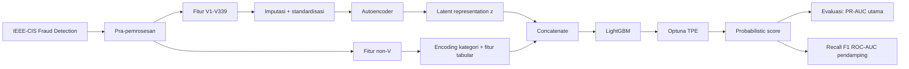

# Penelitian Mendalam Referensi Akademik untuk Proposal Tugas Akhir Autoencoder–LightGBM pada IEEE-CIS Fraud Detection

## Ringkasan Eksekutif

Dari penelusuran ini, pusat gravitasi literatur yang paling kuat untuk proposal Anda adalah enam rujukan berikut: Ding et al. (2024) dan Du et al. (2023) karena paling dekat dengan pipeline **Autoencoder + LightGBM**; Nguyen et al. (2022) karena memberi **benchmark peer-reviewed yang spesifik pada dataset IEEE-CIS Fraud Detection**; Saito dan Rehmsmeier (2015) serta Davis dan Goadrich (2006) karena memberi **landasan metodologis kuat untuk menjadikan PR-AUC/AUPRC sebagai metrik utama pada data sangat imbalanced**; dan Ke et al. (2017) karena merupakan rujukan primer untuk pemilihan **LightGBM** pada data tabular besar. Di atas itu, Dal Pozzolo et al. (2018) penting untuk menguatkan argumen tentang **evaluasi yang realistis** pada fraud detection, sedangkan Lim et al. (2024), Akiba et al. (2019), dan Bergstra et al. memberi basis yang kuat untuk **Bayesian Optimization/TPE/Optuna**. fileciteturn0file0 citeturn17view4turn18view1turn28view0turn46academia7

Secara metodologis, literatur yang paling mendukung proposal Anda menyatakan tiga hal besar. Pertama, pada data yang sangat tidak seimbang, **PR curve dan PR-AUC/AUPRC lebih informatif daripada ROC**, sehingga keputusan Anda menjadikan PR-AUC sebagai metrik utama sudah tepat. Kedua, **LightGBM** tetap merupakan pilihan yang masuk akal untuk data tabular besar dan banyak missing value. Ketiga, **hybrid pipeline** yang menggabungkan pembelajaran representasi non-linear dengan boosted trees memang punya preseden ilmiah yang cukup kuat, walau implementasi detailnya masih perlu Anda pertajam. fileciteturn0file0 citeturn17view4turn46search0turn18view1

Kesimpulan praktisnya: untuk proposal final, Anda sebaiknya menempatkan (i) **Ding 2024 + Du 2023** sebagai pembenaran arsitektur inti, (ii) **Nguyen 2022 + sumber resmi IEEE-CIS** sebagai pembenaran benchmark/dataset, (iii) **Saito 2015 + Davis 2006 + Boyd 2013** sebagai pembenaran evaluasi PR-AUC, dan (iv) **Ke 2017 + Lim 2024 + Akiba 2019** sebagai pembenaran model classifier dan tuning. Dengan kombinasi ini, proposal Anda akan tampak lebih rapi secara metodologis dan lebih kuat secara bibliografis. fileciteturn0file0 citeturn17view4turn41academia7turn46academia7

## Kesesuaian dengan Draf Proposal Anda

Draf proposal yang Anda unggah sudah cukup jelas memosisikan penelitian sebagai **deteksi penipuan transaksi e-commerce** pada **IEEE-CIS Fraud Detection**, menggunakan **Autoencoder** untuk representasi fitur, **LightGBM** sebagai classifier utama, **Bayesian Optimization via Optuna/TPE** untuk tuning, dan **PR-AUC** sebagai metrik utama, dengan metrik pendamping Recall, F1-score, dan ROC-AUC. Draf juga sudah menjelaskan baseline LightGBM, penggunaan fitur `V1–V339` untuk jalur Autoencoder, serta skema split stratified `60/20/20`. Itu berarti kerangka dasar Anda sudah konsisten dengan literatur yang saya pilih sebagai rujukan prioritas. fileciteturn0file0

Namun, masih ada beberapa keputusan metodologis yang menurut saya belum “terkunci” di draf dan akan sangat menentukan kekuatan proposal saat sidang atau review dosen. Yang paling penting ialah: apakah **Autoencoder dilatih pada seluruh training set** atau hanya transaksi non-fraud; bagaimana **dimensi latent space** dipilih; bagaimana **threshold klasifikasi** ditentukan dari skor probabilitas; apakah **PR-AUC** yang Anda laporkan adalah *average precision* atau luas trapezoidal klasik; dan apakah Anda akan tetap memakai **random stratified split** atau mempertimbangkan **split yang lebih realistis/temporal**. Literatur evaluasi PR dan literatur realistic fraud modeling membuat pertanyaan-pertanyaan itu menjadi sangat penting, bukan sekadar detail implementasi. fileciteturn0file0 citeturn17view4turn41academia7

Untuk pengecekan **quartile** venue, saya sarankan Anda konsisten memakai dua pintu berikut pada tahap finalisasi daftar pustaka. Karena beberapa jurnal bersifat multi-kategori, quartile bisa berbeda tergantung kategori dan tahun; akibatnya, pada tabel di bawah saya memakai label **“Q1 kuat”**, **“cek manual”**, atau **“NA”** secara konservatif.

```text
SJR / SCImago Journal Search:
https://www.scimagojr.com/journalsearch.php

Clarivate Master Journal List / JCR entry point:
https://mjl.clarivate.com/
```

## Cara Saya Memilih Referensi

Saya memprioritaskan referensi berdasarkan lima sumbu relevansi: **Autoencoder untuk fraud/anomaly detection pada data tabular/transaksional**, **LightGBM atau gradient-boosted trees untuk fraud/imbalanced classification**, **penggunaan dataset IEEE-CIS Fraud Detection**, **justifikasi PR-AUC/AUPRC untuk class imbalance**, dan **kombinasi dua atau lebih elemen tersebut dalam satu pipeline**. Referensi yang sangat dekat dengan arsitektur Anda saya taruh dalam **sepuluh prioritas utama**; referensi yang lebih fondasional, lebih teoritis, atau masih berupa preprint tetapi sangat berguna saya taruh pada **dua puluh referensi lanjutan**. fileciteturn0file0 citeturn18view1turn28view0turn17view4

Agar tetap rigor, saya membedakan tiga jenis sumber. **Peer-reviewed jurnal/konferensi** saya perlakukan sebagai sumber inti. **Preprint** saya masukkan hanya jika kontribusinya sangat dekat dengan IEEE-CIS, AUPRC, atau hybrid tabular fraud detection, dan saya tandai secara eksplisit sebagai preprint/non-peer-reviewed. **Sumber otoritatif non-paper** saya masukkan hanya bila memang diperlukan untuk legitimasi benchmark, terutama untuk dataset IEEE-CIS. citeturn18view1turn28view0turn23academia2turn23academia0

## Sepuluh Referensi Paling Relevan

Tabel berikut merangkum sepuluh referensi yang paling relevan dengan proposal Anda. Saya menggunakan kolom “quartile best-effort” secara konservatif: saya hanya menulis “Q1 kuat” ketika venue-nya memang jelas sangat mapan; selebihnya saya sarankan cek manual di SJR/JCR tahun berjalan.

| Prioritas | Referensi singkat | Kecocokan utama | Dataset utama | Metrik yang ditekankan | Kode | Quartile best-effort |
| --- | --- | --- | --- | --- | --- | --- |
| 1 | Ding et al. (2024) fileciteturn0file0 | **AE + LightGBM** | Fraud transaksi kartu | Recall, F-measure, AUC, MCC, BCR | Tidak terverifikasi | cek manual |
| 2 | Du et al. (2023) fileciteturn0file0 | **AE + LightGBM** | Fraud transaksi kartu | klasifikasi fraud + efek SMOTE | Tidak terverifikasi | cek manual |
| 3 | Nguyen et al. (2022) fileciteturn0file0turn43search1 | **IEEE-CIS + hybrid model** | **IEEE-CIS Fraud Detection** | benchmark fraud classification | Tidak terverifikasi | cek manual |
| 4 | Lim et al. (2024) fileciteturn0file0 | **Bayesian Optimization/TPE** | Fraud transaksi kartu | F1, FPR, stabilitas tuning | Tidak terverifikasi | cek manual |
| 5 | Ke et al. (2017) fileciteturn0file0turn46search0 | **LightGBM** | Data tabular besar | efisiensi + akurasi | Ya, repo resmi | NA konferensi |
| 6 | Misra et al. (2020) fileciteturn0file0 | **Autoencoder untuk fraud** | Fraud transaksi kartu | representasi laten / deteksi fraud | Tidak terverifikasi | NA prosiding |
| 7 | Dal Pozzolo et al. (2018) fileciteturn0file0turn35search1 | **Realistic fraud modeling** | Credit-card fraud realistis | strategi evaluasi & learning | Tidak terverifikasi | **Q1 kuat** |
| 8 | Saito & Rehmsmeier (2015) citeturn17view4 | **PR-AUC / imbalanced evaluation** | Simulasi + data imbalanced | **PR vs ROC** | Tidak relevan | cek manual |
| 9 | Davis & Goadrich (2006) fileciteturn0file0 | **Relasi PR–ROC** | Teoretis | **PR vs ROC** | Tidak relevan | NA konferensi |
| 10 | Hilal et al. (2022) citeturn18view1 | **Anomaly detection review** | Multi-domain financial fraud | survei metode AD | Tidak relevan | **Q1 kuat** |

**R1 — Ding, L., Liu, L., Wang, Y., Shi, P., & Yu, J. (2024).** *An AutoEncoder enhanced light gradient boosting machine method for credit card fraud detection*. *PeerJ Computer Science*, 10. `DOI: 10.7717/peerj-cs.2323`. Venue/quartile best-effort: jurnal peer-reviewed; quartile perlu cek manual. Ini adalah rujukan paling dekat dengan arsitektur inti proposal Anda karena menggabungkan Autoencoder sebagai pembelajar representasi laten dan LightGBM sebagai classifier fraud. Dari ringkasan empiris yang sudah ada di draf Anda, paper ini melaporkan peningkatan pada Recall, F-measure, AUC, MCC, dan BCR dibanding penggunaan model tunggal. Secara strategis, ini adalah sitasi terbaik untuk menjustifikasi kalimat “integrasi feature representation non-linear dan boosted-tree classification dapat meningkatkan deteksi fraud pada data transaksional kompleks.” Kode resmi: tidak saya verifikasi pada sesi ini. fileciteturn0file0

**R2 — Du, H., Lv, L., Guo, A., & Wang, H. (2023).** *AutoEncoder and LightGBM for Credit Card Fraud Detection Problems*. *Symmetry*, 15(4). `DOI: 10.3390/sym15040870`. Venue/quartile best-effort: jurnal peer-reviewed; quartile perlu cek manual. Sama seperti Ding et al., paper ini sangat kuat untuk proposal Anda karena sama-sama membangun jalur **Autoencoder → LightGBM** pada problem fraud. Draf Anda mencatat bahwa studi ini juga mengevaluasi SMOTE dan menunjukkan model AE–LightGBM tetap kompetitif bahkan tanpa resampling, yang sangat relevan dengan keputusan proposal Anda untuk tidak menjadikan resampling sebagai fokus utama. Kode resmi: tidak saya verifikasi pada sesi ini. fileciteturn0file0

**R3 — Nguyen, N., Duong, T., Chau, T., Nguyen, V.H., Trinh, T., Tran, D., & Ho, T. (2022).** *A Proposed Model for Card Fraud Detection Based on CatBoost and Deep Neural Network*. *IEEE Access*, 10, 96852–96861. `DOI: 10.1109/ACCESS.2022.3205416`. Venue/quartile best-effort: jurnal peer-reviewed; quartile perlu cek manual. Meskipun modelnya bukan Autoencoder–LightGBM, paper ini sangat penting karena menggunakan **dataset IEEE-CIS Fraud Detection**, sehingga relevan sebagai benchmark yang spesifik terhadap benchmark yang ingin Anda pakai. Nilai utamanya bagi proposal Anda ialah menunjukkan bahwa hybridisasi model boosting tabular dan deep learning memang mempunyai preseden peer-reviewed pada IEEE-CIS. Kode resmi: tidak saya verifikasi pada sesi ini. fileciteturn0file0turn43search1

**R4 — Lim, Z.Y., Pang, Y.H., Kamarudin, K.Z.B., Ooi, S.Y., & Hiew, F.S. (2024).** *Bayesian optimization driven strategy for detecting credit card fraud with Extremely Randomized Trees*. *MethodsX*. `DOI/URL: belum saya verifikasi terbuka pada sesi ini`. Venue/quartile best-effort: jurnal metode; cek manual. Paper ini penting bukan karena model utamanya Extra Trees, melainkan karena ia memberi legitimasi kuat untuk **Bayesian Optimization berbasis TPE** pada fraud detection. Draf Anda merangkum bahwa pendekatan ini meningkatkan stabilitas F1-score sekaligus menurunkan false positive rate pada data transaksi finansial nyata, sehingga langsung mendukung keputusan Anda memakai **Optuna/TPE** untuk tuning LightGBM. Kode resmi: tidak saya verifikasi pada sesi ini. fileciteturn0file0

**R5 — Ke, G., Meng, Q., Finley, T., Wang, T., Chen, W., Ma, W., Ye, Q., & Liu, T.-Y. (2017).** *LightGBM: A Highly Efficient Gradient Boosting Decision Tree*. *Advances in Neural Information Processing Systems*. `URL/DOI: prosiding NeurIPS 2017; tidak memakai DOI yang saya verifikasi pada sesi ini`. Venue/quartile best-effort: konferensi top-tier; quartile jurnal NA. Ini adalah rujukan primer untuk menjelaskan **mengapa LightGBM cocok**: leaf-wise tree growth, histogram-based splitting, GOSS, dan EFB membuatnya efisien pada data tabular besar dan fitur yang banyak. Karena IEEE-CIS adalah dataset tabular besar dengan banyak missing value dan fitur heterogen, sitasi ini wajib muncul pada subbab dasar teori dan argumen pemilihan classifier. Kode resmi tersedia melalui repo LightGBM. fileciteturn0file0turn46search0

**R6 — Misra, S., Thakur, S., Ghosh, M., & Saha, S.K. (2020).** *An Autoencoder Based Model for Detecting Fraudulent Credit Card Transaction*. *Procedia Computer Science*, 167, 254–262. `DOI: 10.1016/j.procs.2020.03.219`. Venue/quartile best-effort: prosiding; quartile jurnal NA. Paper ini tidak memakai LightGBM, tetapi justru berharga untuk memperkuat porsi **Autoencoder** dalam proposal Anda. Draf Anda merangkum bahwa autoencoder di sini efektif untuk mempelajari struktur laten data transaksi yang berdimensi tinggi dan membantu membedakan transaksi normal versus fraud pada kondisi imbalance. Jadi, bila Anda ingin membela keberadaan Autoencoder secara terpisah dari LightGBM, ini salah satu sitasi yang paling tepat. Kode resmi: tidak saya verifikasi pada sesi ini. fileciteturn0file0

**R7 — Dal Pozzolo, A., Boracchi, G., Caelen, O., Alippi, C., & Bontempi, G. (2018).** *Credit card fraud detection: A realistic modeling and a novel learning strategy*. *IEEE Transactions on Neural Networks and Learning Systems*, 29(8), 3784–3797. `DOI: 10.1109/TNNLS.2017.2736643`. Venue/quartile best-effort: **Q1 kuat**. Ini adalah salah satu paper fraud detection klasik yang paling berguna untuk menegaskan bahwa evaluasi fraud sebaiknya meniru kondisi operasional yang realistis, bukan sekadar menghasilkan angka bagus dari split acak yang terlalu mudah. Untuk proposal Anda, paper ini sangat penting sebagai penyeimbang karena draf saat ini masih memakai **stratified random split 60/20/20**; paper ini memberi dasar untuk mendiskusikan potensi bias optimistis pada evaluasi fraud. Kode resmi: tidak saya verifikasi pada sesi ini. fileciteturn0file0turn35search1

**R8 — Saito, T., & Rehmsmeier, M. (2015).** *The Precision-Recall Plot Is More Informative than the ROC Plot When Evaluating Binary Classifiers on Imbalanced Datasets*. *PLOS ONE*, 10(3), e0118432. `DOI: 10.1371/journal.pone.0118432`. Venue/quartile best-effort: jurnal peer-reviewed; quartile perlu cek manual. Artikel ini sangat penting untuk proposal Anda karena secara eksplisit menunjukkan bahwa pada dataset yang imbalanced, visualisasi ROC dapat menyesatkan, sedangkan PR curve lebih informatif karena fokus pada proporsi true positives di antara prediksi positif. Jika dosen penguji bertanya mengapa Anda memprioritaskan PR-AUC alih-alih ROC-AUC, paper inilah jawaban metodologis yang paling langsung dan paling kuat. Kode: tidak relevan. citeturn17view4

**R9 — Davis, J., & Goadrich, M. (2006).** *The Relationship between Precision-Recall and ROC Curves*. *Proceedings of the 23rd International Conference on Machine Learning*. `DOI: 10.1145/1143844.1143874`. Venue/quartile best-effort: konferensi ML; quartile jurnal NA. Paper ini adalah rujukan teoritis klasik yang melengkapi Saito & Rehmsmeier. Jika Saito memberi argumen yang sangat intuitif untuk data imbalanced, maka Davis & Goadrich memberi fondasi yang lebih formal tentang hubungan antara PR dan ROC. Untuk proposal Anda, pasangan Saito–Davis adalah kombinasi paling kuat untuk subbab metrik evaluasi. Kode: tidak relevan. fileciteturn0file0

**R10 — Hilal, W., Gadsden, S.A., & Yawney, J. (2022).** *Financial Fraud: A Review of Anomaly Detection Techniques and Recent Advances*. *Expert Systems with Applications*, 193, 116429. `DOI: 10.1016/j.eswa.2021.116429`. Venue/quartile best-effort: **Q1 kuat**. Sebagai review otoritatif, paper ini menempatkan studi Anda ke lanskap yang lebih luas: anomaly detection, semi-supervised learning, dan unsupervised learning untuk fraud. Review ini menyatakan bahwa surveinya merangkum teknik anomaly detection yang paling populer dan efektif, serta menyoroti perkembangan semi-supervised dan unsupervised yang relevan untuk financial fraud. Itu sangat berguna untuk menjelaskan mengapa komponen Autoencoder dalam proposal Anda juga masuk akal dari sudut pandang anomaly/representation learning, bukan hanya dari sudut klasifikasi supervised. citeturn18view1

Berikut adalah **kalimat sitasi siap-tempel** yang dapat langsung Anda masukkan ke proposal untuk sepuluh sumber prioritas di atas.

| Paper | Kalimat sitasi siap-tempel |
| --- | --- |
| Ding et al. (2024) | “Pendekatan hibrida Autoencoder–LightGBM telah dilaporkan mampu meningkatkan performa deteksi fraud dibanding penggunaan model tunggal pada data transaksi yang kompleks dan berdimensi tinggi.” fileciteturn0file0 |
| Du et al. (2023) | “Studi terdahulu menunjukkan bahwa kombinasi Autoencoder dan LightGBM tetap kompetitif untuk deteksi credit-card fraud bahkan ketika resampling tidak dijadikan komponen utama pipeline.” fileciteturn0file0 |
| Nguyen et al. (2022) | “Pada benchmark IEEE-CIS Fraud Detection, pendekatan hibrida yang menggabungkan boosted trees dan deep learning telah digunakan sebagai strategi untuk meningkatkan akurasi deteksi fraud pada data tabular yang kompleks.” fileciteturn0file0turn43search1 |
| Lim et al. (2024) | “Bayesian Optimization berbasis TPE dapat digunakan untuk memperoleh konfigurasi model fraud detection yang lebih stabil dan lebih efisien daripada pencarian hyperparameter konvensional.” fileciteturn0file0 |
| Ke et al. (2017) | “LightGBM relevan untuk data tabular berskala besar karena menawarkan efisiensi komputasi tinggi melalui leaf-wise growth, histogram-based splitting, serta mekanisme GOSS dan EFB.” fileciteturn0file0turn46search0 |
| Misra et al. (2020) | “Autoencoder dapat dimanfaatkan untuk mempelajari representasi laten yang lebih ringkas dan informatif pada data transaksi kartu kredit yang berdimensi tinggi dan tidak seimbang.” fileciteturn0file0 |
| Dal Pozzolo et al. (2018) | “Literatur fraud detection menekankan pentingnya strategi pemodelan dan evaluasi yang realistis agar estimasi kinerja model tidak terlalu optimistis terhadap data operasional.” fileciteturn0file0turn35search1 |
| Saito & Rehmsmeier (2015) | “Pada dataset yang sangat imbalanced, precision–recall curve dan PR-AUC lebih informatif daripada ROC curve karena lebih berfokus pada performa kelas positif.” citeturn17view4 |
| Davis & Goadrich (2006) | “Hubungan antara ROC dan precision–recall curve menunjukkan bahwa evaluasi pada data imbalanced tidak dapat hanya bergantung pada ROC-AUC.” fileciteturn0file0 |
| Hilal et al. (2022) | “Kajian mutakhir tentang financial fraud menunjukkan bahwa teknik anomaly detection, termasuk pendekatan semi-supervised dan unsupervised, tetap relevan untuk menangani fraud yang dinamis dan sulit diberi label.” citeturn18view1 |

## Dua Puluh Referensi Lanjutan

**R11 — Ali, A., Abd Razak, S., Othman, S.H., Eisa, T.A.E., Al-Dhaqm, A., Nasser, M., Elhassan, T., Elshafie, H., & Saif, A. (2022).** *Financial Fraud Detection Based on Machine Learning: A Systematic Literature Review*. *Applied Sciences*, 12(19), 9637. `DOI: 10.3390/app12199637`. Venue/quartile best-effort: jurnal peer-reviewed; cek manual. Review ini menyeleksi **93 artikel** setelah proses inklusi/eksklusi dan merangkum teknik ML yang populer, jenis fraud yang dominan, serta metrik evaluasi yang paling sering dipakai. Kegunaannya bagi proposal Anda sangat besar untuk memperkuat latar belakang dan menunjukkan gap riset secara sistematis, terutama bila Anda ingin menulis subbab “tinjauan pustaka” yang tidak hanya bersifat naratif. citeturn28view0

**R12 — Hinton, G.E., & Salakhutdinov, R.R. (2006).** *Reducing the Dimensionality of Data with Neural Networks*. *Science*, 313(5786), 504–507. `DOI: 10.1126/science.1129198`. Venue/quartile best-effort: **Q1 kuat**. Walau bukan paper fraud detection, ini adalah rujukan utama untuk justifikasi konseptual Autoencoder sebagai metode pembelajaran representasi dan reduksi dimensi non-linear. Dalam proposal Anda, paper ini paling cocok dipakai untuk membela *mengapa* latent representation dari fitur `V1–V339` layak dipakai sebagai input bagi classifier tabular. fileciteturn0file0turn41search2

**R13 — Akiba, T., Sano, S., Yanase, T., Ohta, T., & Koyama, M. (2019).** *Optuna: A Next-generation Hyperparameter Optimization Framework*. *Proceedings of the ACM SIGKDD International Conference on Knowledge Discovery and Data Mining*, 2623–2631. `DOI: 10.1145/3292500.3330701`. Venue/quartile best-effort: konferensi top-tier; quartile jurnal NA. Referensi ini sangat berguna bila Anda ingin memberi justifikasi bukan hanya untuk Bayesian Optimization, tetapi juga untuk **software stack** yang Anda pilih, yaitu Optuna. Abstrak paper menekankan *define-by-run API*, strategi search/pruning yang efisien, dan ketersediaan software open-source, sehingga menjadikannya sitasi yang tepat di bagian metodologi eksperimen. citeturn46academia7

**R14 — Shahriari, B., Swersky, K., Wang, Z., Adams, R.P., & de Freitas, N. (2016).** *Taking the Human out of the Loop: A Review of Bayesian Optimization*. *Proceedings of the IEEE*, 104(1), 148–175. `DOI: 10.1109/JPROC.2015.2494218`. Venue/quartile best-effort: jurnal peer-reviewed; cek manual. Ini adalah citation teoritis yang paling mapan untuk menerangkan apa itu Bayesian Optimization secara umum, bagaimana *surrogate model* dan *acquisition function* bekerja, dan mengapa metode ini lebih efisien daripada pencarian buta. Paper ini sangat berguna jika Anda ingin menulis subbagian teori optimasi hyperparameter yang lebih matang daripada sekadar menyebut Optuna sebagai library. fileciteturn0file0

**R15 — Bergstra, J., & Bengio, Y. (2012).** *Random Search for Hyper-Parameter Optimization*. *Journal of Machine Learning Research*, 13. `DOI/URL: artikel JMLR; DOI tidak saya verifikasi pada sesi ini`. Venue/quartile best-effort: jurnal peer-reviewed; cek manual. Paper ini penting sebagai pasangan pembanding untuk Bayesian Optimization karena menunjukkan bahwa **random search** sering lebih efektif daripada grid search pada ruang hyperparameter besar. Dalam proposal Anda, paper ini cocok digunakan untuk menjelaskan mengapa pembandingan terhadap grid/random search punya dasar literatur yang kuat. fileciteturn0file0

**R16 — Bergstra, J., Bardenet, R., Bengio, Y., & Kégl, B. (2011).** *Algorithms for Hyper-Parameter Optimization*. `DOI/URL: belum saya verifikasi terbuka pada sesi ini`. Venue/quartile best-effort: konferensi; quartile jurnal NA. Ini adalah salah satu rujukan klasik untuk **Tree-structured Parzen Estimator** dan sangat erat dengan fondasi teoritis TPE yang dipakai Optuna. Jika Anda ingin proposal terlihat lebih teknis, paper ini layak dimasukkan berdampingan dengan Akiba et al. dan Shahriari et al. fileciteturn0file0

**R17 — Ge, D., Gu, J., Chang, S., & Cai, J.H. (2020).** *Credit Card Fraud Detection Using LightGBM Model*. *Proceedings of the 2020 International Conference on E-Commerce and Internet Technology*, 232–236. `DOI: 10.1109/ECIT50008.2020.00060`. Venue/quartile best-effort: prosiding; quartile jurnal NA. Paper ini lebih sederhana daripada Ke et al. karena berfokus langsung pada aplikasi LightGBM untuk fraud detection. Nilainya bagi proposal Anda ada pada sifatnya yang aplikatif: ia menunjukkan bahwa LightGBM memang telah digunakan secara spesifik dalam konteks deteksi fraud, bukan hanya sebagai algoritma umum. fileciteturn0file0

**R18 — Huang, K. (2020).** *An Optimized LightGBM Model for Fraud Detection*. *Journal of Physics: Conference Series*, 1651(1). `DOI: 10.1088/1742-6596/1651/1/012111`. Venue/quartile best-effort: prosiding/journal conference series; cek manual. Paper ini relevan untuk memperkaya bagian yang membahas bahwa LightGBM bukan hanya kuat sebagai baseline, tetapi juga sensitif terhadap tuning. Anda dapat memanfaatkannya sebagai sitasi tambahan ketika menjelaskan mengapa hyperparameter optimization merupakan bagian esensial dari desain eksperimen. fileciteturn0file0

**R19 — Thimonier, H., Popineau, F., Rimmel, A., Doan, B.-L., & Daniel, F. (2023).** *Comparative Evaluation of Anomaly Detection Methods for Fraud Detection in Online Credit Card Payments*. `arXiv:2312.13896`. Venue/quartile: **preprint, NA**. Preprint ini menarik karena membandingkan metode anomaly detection dengan supervised learning pada data pembayaran online nyata dan menyimpulkan bahwa **LightGBM** unggul pada semua metrik yang diuji, walau lebih sensitif terhadap distribution shift. Untuk proposal Anda, paper ini berguna sebagai pengingat bahwa hybrid AE + LightGBM harus diuji secara hati-hati terhadap perubahan distribusi, bukan hanya terhadap angka test set tunggal. citeturn3academia1

**R20 — Lucas, Y., Portier, P.-E., Laporte, L., Caelen, O., He-Guelton, L., Calabretto, S., & Granitzer, M. (2019).** *Multiple perspectives HMM-based feature engineering for credit card fraud detection*. `arXiv:1905.06247`. Venue/quartile: **preprint, NA**. Meski bukan Autoencoder, paper ini sangat relevan secara metodologis karena menunjukkan bahwa **feature engineering/representation learning** yang menambahkan struktur temporal/sekuensial dapat menaikkan **precision-recall AUC hingga sekitar 15%** dibanding strategi feature engineering sebelumnya. Itu membuatnya menjadi sitasi yang baik untuk mendukung ide bahwa “memperkaya representasi sebelum classifier” adalah strategi yang bernilai pada fraud detection. citeturn19academia1

**R21 — Niu, X., Wang, L., & Yang, X. (2019).** *A Comparison Study of Credit Card Fraud Detection: Supervised versus Unsupervised*. `arXiv:1904.10604`. Venue/quartile: **preprint, NA**. Paper ini membandingkan model supervised seperti LR, KNN, SVM, DT, RF, dan XGB dengan model unsupervised seperti OCSVM, Autoencoder, RBM, dan GAN. Hasilnya menunjukkan supervised models masih unggul pada AUROC, tetapi Autoencoder tetap relevan sebagai pendekatan ketika anotasi terbatas. Ini cocok dipakai untuk menjelaskan bahwa komponen Autoencoder dalam proposal Anda dapat dibaca sebagai upaya mengambil manfaat pembelajaran representasi unsupervised di dalam pipeline supervised. citeturn36academia2

**R22 — Isangediok, M., & Gajamannage, K. (2022).** *Fraud Detection Using Optimized Machine Learning Tools Under Imbalance Classes*. `arXiv:2209.01642`. Venue/quartile: **preprint, NA**. Nilai penting paper ini adalah ia secara eksplisit membandingkan **AUC ROC dan AUC PR** pada data fraud yang imbalanced, lalu menunjukkan XGBoost cukup kuat bahkan pada data asli yang tidak diseimbangkan. Itu relevan untuk proposal Anda karena memperkuat ide bahwa boosted-tree models sering tetap kuat pada data imbalanced selama evaluasinya memakai metrik yang tepat. citeturn20academia3

**R23 — Singh, M.T., Prasad, R.K., Michael, G.R., Kaphungkui, N.K., & Singh, N.H. (2024).** *Heterogeneous Graph Auto-Encoder for CreditCard Fraud Detection*. `arXiv:2410.08121`. Venue/quartile: **preprint, NA**. Meskipun bergerak ke arah graph fraud detection, paper ini tetap relevan karena memperlihatkan bahwa **Autoencoder** dapat dipakai sebagai bagian dari sistem deteksi fraud yang lebih kaya secara struktur, dan melaporkan **AUC-PR 0.89** serta **F1 0.81**. Bagi proposal Anda, sumber ini berguna untuk menunjukkan bahwa AE tidak hanya dipakai untuk reduksi dimensi tradisional, tetapi juga tetap hidup dalam garis riset fraud detection modern. citeturn42academia2

**R24 — Xu, B., Wang, Y., Liao, X., & Wang, K. (2023).** *Efficient Fraud Detection Using Deep Boosting Decision Trees*. `arXiv:2302.05918`. Venue/quartile: **preprint, NA**. Paper ini menarik karena mencoba menjembatani boosted trees dan neural networks dengan meng-ensemble *soft decision trees* memakai ide gradient boosting. Secara konseptual, ia berada pada keluarga yang mirip dengan proposal Anda: **mengawinkan kekuatan representasional jaringan saraf dan kekuatan klasifikasi pohon/boosting**, serta paper ini juga menyediakan kode. citeturn33academia5

**R25 — Almalki, F., & Masud, M. (2025).** *Financial Fraud Detection Using Explainable AI and Stacking Ensemble Methods*. `arXiv:2505.10050`. Venue/quartile: **preprint, NA**. Paper ini memakai **IEEE-CIS Fraud Detection** dan menggabungkan **XGBoost, LightGBM, dan CatBoost** dalam stacking ensemble, ditambah SHAP/LIME/PDP/PFI untuk interpretabilitas. Walau bukan sumber utama untuk proposal Anda, ini adalah benchmark tambahan yang menarik bila Anda nanti ingin menulis bagian “arah pengembangan lanjutan” atau menyebut bahwa model Anda bisa dibandingkan dengan ensemble boosting modern pada dataset yang sama. citeturn23academia0

**R26 — Sha, Q., Tang, T., Du, X., Liu, J., Wang, Y., & Sheng, Y. (2025).** *Detecting Credit Card Fraud via Heterogeneous Graph Neural Networks with Graph Attention*. `arXiv:2504.08183`. Venue/quartile: **preprint, NA**. Ini juga menggunakan **IEEE-CIS Fraud Detection**, tetapi berpindah ke paradigma graph neural networks. Dalam proposal Anda, paper ini tidak perlu dijadikan rujukan utama, namun sangat berguna sebagai “tetangga metodologis” untuk menunjukkan bahwa IEEE-CIS sering dipakai bukan hanya untuk boosted trees, tetapi juga untuk model representasi yang lebih kompleks. citeturn36academia1

**R27 — Xiang, S., Zhu, M., Cheng, D., Li, E., Zhao, R., Ouyang, Y., Chen, L., & Zheng, Y. (2024).** *Semi-supervised Credit Card Fraud Detection via Attribute-Driven Graph Representation*. `arXiv:2412.18287`. Venue/quartile: **preprint, NA**. Nilai penting paper ini ada pada pesan metodologisnya: representasi data sangat menentukan performa fraud detection ketika label sedikit dan hubungan antar-transaksi penting. Walau bukan referensi inti untuk proposal Anda, paper ini bisa memperkaya pembahasan bahwa **representation learning** merupakan tema yang semakin sentral dalam fraud detection, sehingga pilihan Autoencoder Anda punya konteks yang kuat. citeturn38academia2

**R28 — Boyd, K., Santos Costa, V., Davis, J., & Page, D. (2013).** *Unachievable Region in Precision-Recall Space and Its Effect on Empirical Evaluation*. `arXiv:1206.4667`. Venue/quartile: **preprint, NA**. Ini adalah paper metrik yang sangat berguna bila Anda ingin membuat subbab evaluasi benar-benar kuat secara teoritis. Kontribusinya adalah menunjukkan bahwa ruang PR memiliki daerah yang memang tidak dapat dicapai dan bentuknya bergantung pada class skew, sehingga PR-AUC tidak boleh diperlakukan terlalu naif. Bagi proposal Anda, paper ini cocok sebagai sitasi pendukung tambahan di bawah Saito dan Davis. citeturn41academia7

**R29 — Gopalakrishnan, V. (2026).** *SilIF: Silhouette-Augmented Isolation Forest for Unsupervised Transaction Fraud Detection*. `arXiv:2605.26135`. Venue/quartile: **preprint, NA**. Paper ini sangat relevan karena memakai **IEEE-CIS Fraud Detection** dan melaporkan peningkatan **AUC-PR** di atas Isolation Forest biasa pada lima seed, serta menyediakan kode secara terbuka. Meskipun modelnya unsupervised dan bukan LightGBM, sumber ini bagus untuk menambah konteks anomaly detection yang dekat dengan gagasan Autoencoder sebagai pembelajar struktur normal versus anomali. citeturn23academia2

**R30 — Howard, A., Bouchon-Meunier, B., IEEE CIS, Lei, J., Vesta, dkk. (2019).** *IEEE-CIS Fraud Detection*. `URL: https://www.kaggle.com/competitions/ieee-fraud-detection`. Venue/quartile: **sumber benchmark otoritatif, NA**. Ini bukan paper jurnal, tetapi justru **sumber resmi benchmark** yang harus Anda sitasi bila benar-benar menggunakan dataset tersebut. Dalam proposal Anda, sumber ini dipakai untuk menjelaskan asal-usul dataset, struktur kompetisi, dan legitimasi IEEE-CIS sebagai benchmark e-commerce fraud detection. fileciteturn0file0

## Repositori Kode dan Implikasi Akademik

Berikut adalah repositori yang menurut saya paling layak Anda simpan karena terkait langsung dengan model yang Anda pakai, tool tuning yang Anda pilih, atau paper yang paling dekat dengan problem Anda. Saya sengaja hanya memasukkan repo yang bisa saya verifikasi secara eksplisit dari sumber yang muncul pada sesi ini.

| Repositori | Terkait | Kegunaan praktis |
| --- | --- | --- |
| `https://github.com/microsoft/LightGBM` | LightGBM / Ke et al. | Implementasi resmi classifier utama Anda. Berguna untuk baseline, training, feature importance, dan integrasi dengan Optuna. citeturn46search0 |
| `https://github.com/optuna/optuna` | Optuna / Akiba et al. | Framework resmi untuk Bayesian Optimization/TPE, pruning, dan dashboard eksperimen. Sangat relevan untuk tuning LightGBM. citeturn46search1turn46academia7 |
| `https://github.com/catboost/catboost` | CatBoost / Nguyen et al. | Berguna jika Anda ingin menambah satu baseline IEEE-CIS yang kuat di luar LightGBM. citeturn46search2 |
| `https://github.com/freshmanXB/DBDT` | Xu et al. (2023) | Contoh arsitektur yang mencoba menggabungkan neural representation dan boosting dalam satu keluarga metode. citeturn33academia5 |
| `https://github.com/venkat15vk/silif-anomaly-detection` | Gopalakrishnan (2026) / SilIF | Contoh kode anomaly detection berbasis IEEE-CIS dengan fokus AUC-PR; berguna untuk baseline unsupervised. citeturn23academia2 |

Jika saya ringkas menjadi bentuk pipeline akademik yang paling defensible untuk proposal Anda, bentuknya kira-kira sebagai berikut.



Secara akademik, ada empat implikasi yang menurut saya paling penting untuk proposal final Anda. Pertama, **nyatakan dengan tegas bahwa studi ini adalah supervised fraud classification yang diperkaya representation learning unsupervised**, bukan sekadar “mencoba dua model lalu digabung”. Kedua, gunakan **Saito 2015 + Davis 2006 + Boyd 2013** agar bagian metrik evaluasi terlihat matang dan PR-AUC tidak tampak sekadar pilihan intuitif. Ketiga, tambahkan **Dal Pozzolo 2018** agar pembahasan split/evaluasi terlihat realistis; jika Anda tetap memakai split acak, jelaskan alasannya sebagai keputusan eksperimental, bukan asumsi bahwa itu paling realistis. Keempat, posisikan **Ding 2024 + Du 2023** sebagai preseden langsung, lalu **Nguyen 2022** sebagai preseden benchmark pada IEEE-CIS, sehingga kebaruan proposal Anda muncul bukan dari klaim “belum pernah ada”, tetapi dari **kombinasi dataset, pipeline, dan fokus evaluasi PR-AUC** yang lebih terstruktur. fileciteturn0file0 citeturn17view4turn41academia7turn18view1turn46academia7

Secara sangat praktis, bila Anda harus memangkas daftar pustaka menjadi inti yang paling kuat, jangan buang: **Ding 2024, Du 2023, Nguyen 2022, Ke 2017, Dal Pozzolo 2018, Saito 2015, Davis 2006, Lim 2024, Akiba 2019, dan sumber resmi IEEE-CIS**. Sepuluh sumber itu sudah cukup untuk menopang hampir seluruh proposal Anda: latar belakang, tinjauan pustaka, dasar teori, pemilihan model, pemilihan metrik, pemilihan dataset, dan pemilihan strategi tuning. Sisanya berfungsi sebagai penguat, pembanding, atau rujukan lanjutan bila dosen meminta justifikasi yang lebih dalam. fileciteturn0file0 citeturn17view4turn46academia7