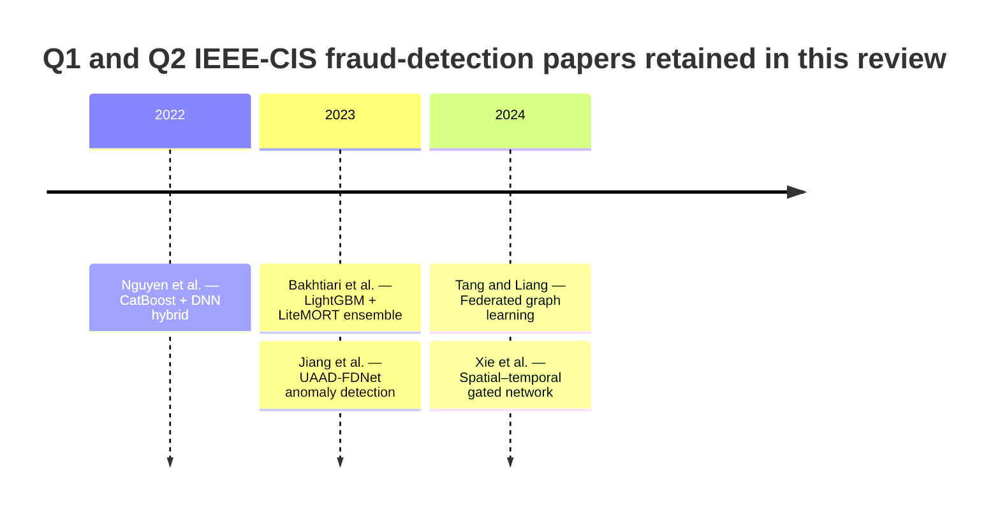

# IEEE-CIS Fraud Detection Papers in Q1 and Q2 Venues

## Executive summary

I screened accessible peer-reviewed journal articles that **explicitly use the IEEE-CIS Fraud Detection dataset** and then cross-checked venue quality using **Journal Citation Reports where directly stated by the publisher** or **Scopus quartile/percentile fields mirrored by the University of Twente/WUR journal browser, which links back to Scopus metrics**. On that basis, I found **five eligible papers with high-to-moderate confidence**, and all five are in **Q1 venues** in the accessible source set. Three of them are strong “anchor papers” because their methods are recoverable in enough detail to replicate meaningfully: **Nguyen et al. (2022)** in *IEEE Access*, **Bakhtiari et al. (2023)** in *Multimedia Tools and Applications*, and **Jiang et al. (2023)** in *Systems*. Two additional 2024 papers in strong Q1 venues are identifiable as IEEE-CIS studies, but their accessible sources expose much thinner methodological detail: **Tang and Liang (2024)** in *Expert Systems with Applications* and **Xie et al. (2024)** in *IEEE Transactions on Automation Science and Engineering*. citeturn27view0turn16search0turn10search0turn2view0turn44view0turn40view0turn15view2turn40view2turn42search0

The single best replication anchor is **Nguyen et al. (2022)**. Its accessible full text exposes the data-joining logic, missing-value handling, train/test ratio, feature engineering, PCA reduction, DNN architecture, CatBoost hyperparameters, thresholding rule, and deployment sketch. If you need one baseline to re-implement faithfully and then improve, start there. **Bakhtiari et al. (2023)** is the cleanest gradient-boosting ensemble benchmark, while **Jiang et al. (2023)** is the best anomaly-detection-style alternative because it reframes IEEE-CIS as an unsupervised abnormality-detection problem rather than a classic supervised tabular classification task. citeturn27view0turn29view1turn30view1turn16search0turn18view0turn10search0turn11view0turn12view2

A recurrent weakness across this literature is **reproducibility**. Public code is usually absent, train/validation/test chronology is often under-specified, confusion matrices are often not surfaced in accessible versions, and many papers optimize only thresholded classification scores without discussing calibration, cost sensitivity, or realistic time-based validation. That leaves a very practical opening for a new paper: reproduce one strong anchor faithfully, then improve it with a better temporal evaluation protocol, explicit missingness modeling, calibration, and a public artifact package. citeturn27view0turn16search0turn10search0turn2view0

## Scope and screening logic

I retained papers only if they satisfied all of the following in the source set I could verify: **peer-reviewed journal article**, **explicit IEEE-CIS use**, and **Q1 or Q2 venue**. Venue quartiles came from **publisher JCR statements** when directly available, otherwise from **Scopus journal metrics** mirrored by the University of Twente/WUR browser, which reproduces quartile and percentile fields and links them to Scopus source records. *Systems* explicitly states **“Quartile Ranking JCR – Q1”** on the publisher page. *IEEE Access*, *Multimedia Tools and Applications*, *Neural Computing and Applications*, *Expert Systems with Applications*, and *IEEE Transactions on Automation Science and Engineering* all show **Q1** in Scopus 2024 metrics through the WUR mirror. citeturn15view2turn44view0turn40view0turn40view1turn40view2turn42search0

I also excluded some frequently co-cited fraud-detection papers because they do **not** use IEEE-CIS. The clearest example is **Esenogho et al. (2022), “A Neural Network Ensemble With Feature Engineering for Improved Credit Card Fraud Detection,”** which the accessible full text shows is built on the **ULB two-day European credit-card dataset** with 284,807 transactions, not IEEE-CIS. That paper is useful background, but it is not an IEEE-CIS anchor and should not be treated as one in your related-work section. citeturn46view0

Because several 2024–2026 papers are discoverable only through secondary summaries or snippet-level records in the accessible source set, I distinguish between **high-confidence anchor papers** with enough method detail to reproduce and **moderate-confidence eligible papers** whose IEEE-CIS use is verified through accessible secondary synthesis but whose full preprocessing/training details remain unspecified. I mark those unspecified fields explicitly rather than guessing. citeturn27view0turn16search0turn10search0turn2view0

## Comparative table

| Citation | Year | Venue and quartile | Methods | Metrics reported | Best reported performance | Code available | Notes |
|---|---:|---|---|---|---|---|---|
| Nguyen et al., *A Proposed Model for Card Fraud Detection Based on CatBoost and Deep Neural Network*. DOI: 10.1109/ACCESS.2022.3205416. citeturn27view0turn44view0 | 2022 | *IEEE Access* — **Q1** (Scopus 2024). citeturn44view0 | Hybrid **CatBoost + DNN** with user separation, SMOTE, PCA, monthly CV. citeturn27view0turn29view1turn30view1 | AUC, accuracy, precision-recall threshold behavior. citeturn28view7turn30view2 | **CatBoost AUC 0.974**, accuracy 98.64; DNN AUC 0.842, accuracy 97.60. citeturn28view7turn30view2 | No official repo linked in accessible paper. citeturn27view0 | Best-documented replication anchor. |
| Bakhtiari, Nasiri, and Vahidi, *Credit card fraud detection using ensemble data mining methods*. DOI: 10.1007/s11042-023-14698-2. citeturn16search0turn40view0 | 2023 | *Multimedia Tools and Applications* — **Q1** (Scopus 2024). citeturn40view0 | **LightGBM + LiteMORT** with simple and weighted averaging. citeturn18view0 | AUC, recall, F1, precision, accuracy. citeturn17view3turn17view4 | Weighted averaging: **AUC 95.20**, recall 90.65, F1 91.67, precision 92.79, accuracy 99.44. citeturn17view3turn17view4 | No public code/data artifact linked in accessible record. citeturn18view0 | IEEE-CIS is explicit via publisher keyword; split/preprocessing details were not exposed in the accessible source. |
| Jiang et al., *Credit Card Fraud Detection Based on Unsupervised Attentional Anomaly Detection Network*. DOI: 10.3390/systems11060305. citeturn10search0turn15view2 | 2023 | *Systems* — **Q1** (JCR, publisher-stated). citeturn15view2 | **UAAD-FDNet**: autoencoder + GAN + feature attention, anomaly-detection framing. citeturn10search0turn12view2 | Precision, recall, F1, AUC. citeturn11view4 | IEEE-CIS: **F1 0.7510**, AUC 0.8556 with feature attention. citeturn11view4 | No code link on article page. citeturn10search0 | Strong unsupervised/anomaly-detection alternative; IEEE-CIS used as generalization dataset. |
| Tang and Liang, *Credit Card Fraud Detection Based on Federated Graph Learning*. citeturn2view0turn40view2 | 2024 | *Expert Systems with Applications* — **Q1** (Scopus 2024). citeturn40view2 | **Federated graph learning**. citeturn2view0 | F1, precision, recall. citeturn2view0 | **F1 92.53%**, precision 91.21%, recall 93.89%. citeturn2view0 | Unspecified in accessible sources. citeturn2view0 | Eligible, but accessible methodological detail is much thinner than the top three anchors. |
| Xie et al., *A Spatial–Temporal Gated Network for Credit Card Fraud Detection by Learning Transactional Representations*. citeturn2view0turn42search0 | 2024 | *IEEE Transactions on Automation Science and Engineering* — **Q1** (Scopus 2024). citeturn42search0 | **Spatial–temporal gated network** for transactional representations. citeturn2view0 | Unspecified in accessible source set. citeturn2view0 | Unspecified in accessible source set. citeturn2view0 | Unspecified in accessible sources. citeturn2view0 | Likely important temporal-model anchor, but the accessible sources did not expose the full experiment protocol. |

The venue-quality evidence is strongest when the publisher itself states the quartile, as with *Systems*. For the other venues, I relied on the University of Twente/WUR journal browser because it surfaces the underlying **Scopus 2024 quartile, percentile, and rank fields** directly in a public page; that is a reasonable Scopus-grounded proxy when Elsevier’s own source pages are access-restricted. citeturn15view2turn44view0turn40view0turn40view2turn42search0

## Paper dossiers

### Nguyen et al.

**Full citation and venue.** Nguyen, N., Duong, T., Chau, T., Nguyen, V.-H., Trinh, T., Tran, D., and Ho, T. *A Proposed Model for Card Fraud Detection Based on CatBoost and Deep Neural Network*. *IEEE Access*, 10, 96852–96861, 2022. DOI: **10.1109/ACCESS.2022.3205416**. The venue is **Q1 in Scopus 2024**, with *IEEE Access* listed at the 90th percentile in Engineering and Q1 in multiple categories. citeturn27view0turn44view0

**Concise summary.** This is a hybrid, deployment-oriented fraud detector that treats the dataset as a **fraudulent-card prediction** problem rather than a pure transaction-level classifier. The central idea is **user separation**: use **CatBoost** on overlapping or historically observed users and **DNN** on non-overlapping or novel users, then combine their outputs under a monthly cross-validation regime. citeturn27view0turn23view0

**Dataset usage and preprocessing.** The paper states that IEEE-CIS contains **transaction** and **identity** files joined by **TransactionID**, with **433 features** and **590,540 instances** in total. It explains the label semantics as account-level: once a card/account is reported fraudulent, subsequent linked transactions are also treated as fraud. The authors report that roughly **3.5%** of train transactions are fraudulent and that **more than 95% of columns contain missing values**. They split the initial dataset into **training and test sets at a 7:3 ratio**. For numerical features, missing values are **imputed with 0 or the mean**; for categorical features, blank values are filled with **“Unknown”** and then **label encoded**. To handle imbalance, they apply **SMOTE**. For feature engineering, they create customer/card groups using card and identity signals, and they use **PCA to reduce the 339 “V” features to the 30 most important components**. For DNN, the accessible text states that categorical inputs include **ProductCD, card1–card6, addr1, addr2, P_emaildomain, R_emaildomain, and M1–M9**, while non-`V` and non-`id_` numerical variables are normalized to zero mean and zero variance; for CatBoost, the excluded fields include **TransactionID, TransactionDT, isFraud, and the discarded V variables after PCA**. citeturn24view0turn29view2turn29view4turn28view8turn28view9

**Methods, architecture, and training details.** The DNN architecture uses categorical embedding and numerical branches, concatenation, and dense layers. The accessible page image shows the concrete layout: categorical input → embedding → SpatialDropout1D → flatten; numerical input with dropout; then concatenation followed by dense layers. Table 3 exposes the DNN hyperparameters: **learning rate 0.0001**, **binary cross-entropy** loss, and **Nadam** optimizer. The text also states three hidden layers; the accessible OCR reports them as **512–256–1**, while the architecture figure visibly shows dense blocks of **200**, **100**, and **1**, so the paper’s architecture description and figure are not fully harmonized in the accessible rendition. For CatBoost, Table 4 reports **learning rate 0.07**, **Log-loss**, **depth 8**, and **n_estimators 5000**, tuned with **10-fold cross-validation**. For alerting, the operational threshold is set at **0.2**. citeturn29view3turn30view1turn29view0turn28view7

**Evaluation and results.** The paper uses AUC-ROC and accuracy, and it discusses the precision-recall threshold trade-off. The accessible figures report **accuracy 97.60** for the neural network and **98.64** for CatBoost. The corresponding ROC curves give **AUC 0.842** for the DNN and **AUC 0.974** for CatBoost. The precision and recall curves intersect around the **0.2 threshold**. I did not find a published confusion matrix in the accessible source set. citeturn30view2turn28view7

**Code, strengths, limitations, reproducibility.** The accessible article and repository mirrors do **not** expose an official GitHub or Zenodo link. The paper’s biggest strengths are its very concrete preprocessing pipeline, domain-aware grouping logic, hybrid tabular/sequential view of the problem, and an end-to-end deployment sketch using **Apache Flink** and an API. Its main weaknesses are the weak public reproducibility artifact trail, the shift from transaction fraud to account/card fraud semantics, and the reliance on many hand-engineered grouping rules that may be difficult to standardize across replications. Overall reproducibility is **medium to high** relative to the rest of this niche because the core pipeline is still recoverable. citeturn29view5turn27view0

### Bakhtiari et al.

**Full citation and venue.** Bakhtiari, S., Nasiri, Z., and Vahidi, J. *Credit card fraud detection using ensemble data mining methods*. *Multimedia Tools and Applications*, 82, 29057–29075, 2023. DOI: **10.1007/s11042-023-14698-2**. The venue is **Q1 in Scopus 2024** in multiple categories, including Media Technology and Computer Networks and Communications. citeturn16search0turn40view0

**Concise summary.** This paper is a strong **tree-ensemble benchmark** rather than a complex end-to-end system. It studies boosting-style ensemble learning with **LightGBM** and **LiteMORT**, then combines them using **simple averaging** and **weighted averaging**. The official publisher page also lists **“IEEE CIS-fraud detection”** among the article keywords, which is the clearest accessible evidence that IEEE-CIS is part of the experimental setup. citeturn18view0

**Dataset usage and preprocessing.** The accessible Springer record does **not** expose the detailed train/test split, column subset, missing-value strategy, or exact preprocessing pipeline. It does expose the IEEE-CIS keyword and cites the Kaggle competition in the references. Because the full methods section was not available in the accessible publisher preview, those fields must be treated as **unspecified** here. citeturn17view0turn18view0

**Methods and training details.** The accessible abstract states that the authors evaluate **LightGBM** and **LiteMORT** and then combine them using **simple** and **weighted** averaging strategies. The exact hyperparameter grid, stopping rules, and fold structure are **unspecified in the accessible source**. citeturn18view0

**Evaluation and results.** The official abstract provides the key results clearly: for the **weighted averaging** combination of LightGBM and LiteMORT, the paper reports **AUC 95.20**, **Recall 90.65**, **F1-score 91.67**, **Precision 92.79**, and **Accuracy 99.44**. A confusion matrix was not visible in the accessible publisher preview. citeturn17view3turn17view4

**Code, strengths, limitations, reproducibility.** No official code or Zenodo artifact was linked in the accessible paper record. The strengths are that this is a **clean, strong, non-neural benchmark** and therefore an excellent classical baseline for any IEEE-CIS study. The limitation is methodological transparency: the accessible source does not provide enough detail on splitting, feature handling, or hyperparameterization to guarantee exact replication. Reproducibility is therefore **medium at the conceptual level, low-to-medium at the exact-run level**. citeturn16search0turn18view0

### Jiang et al.

**Full citation and venue.** Jiang, S., Dong, R., Wang, J., and Xia, M. *Credit Card Fraud Detection Based on Unsupervised Attentional Anomaly Detection Network*. *Systems*, 11(6):305, 2023. DOI: **10.3390/systems11060305**. The publisher states **“Quartile Ranking JCR – Q1”** on the journal page. citeturn10search0turn15view2

**Concise summary.** This paper is noteworthy because it avoids the standard “oversample minority frauds and classify” pipeline. Instead, it reframes fraud detection as **anomaly detection**, building an **Unsupervised Attentional Anomaly Detection Network** (**UAAD-FDNet**) composed of an **autoencoder**, **GAN**, and **feature attention** module. IEEE-CIS is used as a **generalization dataset** to validate robustness beyond the Kaggle European-card benchmark. citeturn10search0turn12view2

**Dataset usage and preprocessing.** For IEEE-CIS, the paper explicitly names the four files: **train_transaction**, **train_identity**, **test_transaction**, and **test_identity**, with **394**, **41**, **393**, and **41** columns respectively, joined by **TransactionID**. The accessible text says the model trains on **normal transaction data only** and tests on a mixture of normal and fraudulent transactions, consistent with the anomaly-detection framing. Concrete missing-value imputation for IEEE-CIS is **not** spelled out in the accessible source, although the authors argue that the feature-attention mechanism helps suppress adverse effects from missing or incorrect data. citeturn11view0turn12view2turn11view2

**Methods and training details.** The training setup is one of the clearest parts. The experiments are implemented in **PyTorch** on a **GeForce RTX 2080Ti**. They use **Adam**, batch size **256**, maximum **100 epochs**, and a learning rate of **0.01 on IEEE-CIS**. The framework combines **adversarial loss**, **context loss**, and **latent loss**, and the paper notes that the thresholding logic used for the decision rule on the Kaggle dataset also applies to IEEE-CIS. citeturn11view0turn12view2

**Evaluation and results.** On IEEE-CIS, the accessible result table shows: **SVM** (F1 0.3151, AUC 0.5783), **DT** (0.5335, 0.7622), **XGBoost** (0.7275, 0.7892), **KNN** (0.5140, 0.6730), **RF** (0.6623, 0.7405), **LSTM** (0.6941, 0.7802), **CNN** (0.7094, 0.7837), **MLP** (0.7099, 0.8241), **AE** (0.7125, 0.8181), **UAAD-FDNet without feature attention** (F1 0.7349, AUC 0.8390), and **UAAD-FDNet with feature attention** (Precision **0.9337**, Recall **0.6281**, F1 **0.7510**, AUC **0.8556**). That makes it a valuable non-boosting, non-plain-DNN anchor. citeturn11view4

**Code, strengths, limitations, reproducibility.** I did not find a code repository linked from the article page. The strengths are the unsupervised framing, explicit ablation, and reasonably transparent hardware/training setup. The limitations are lower recall than the best supervised methods, unclear exact split construction for IEEE-CIS, and no public artifact package. Reproducibility is **medium**: enough to reproduce the broad method, but not every data-processing choice. citeturn10search0turn11view4

### Tang and Liang

**Full citation and venue.** Tang, L., and Liang, Y. *Credit Card Fraud Detection Based on Federated Graph Learning*. *Expert Systems with Applications*, 247, 2024. The accessible secondary source identifies it as an IEEE-CIS study, and the journal is **Q1 in Scopus 2024**. The DOI/link was **not exposed in the accessible source set**. citeturn2view0turn40view2

**Concise summary.** This paper matters because it represents the shift from flat tabular classifiers toward **graph-native fraud detection** under a **federated** setup. That direction is especially relevant for payment data because identities, devices, addresses, emails, and cards create natural relational structure that standard tree models only approximate indirectly. citeturn2view0

**Dataset usage, methods, and results.** The accessible review chapter identifies the paper as part of the IEEE-CIS literature and reports the following core metrics: **F1-score 92.53%**, **precision 91.21%**, and **recall 93.89%**. The review source does **not** expose the exact graph construction, train/test split protocol, missing-value policy, hyperparameters, or public code availability. Those must therefore be recorded as **unspecified**. citeturn2view0

**Strengths, limitations, reproducibility.** As an anchor, this paper is promising if you want to extend toward **entity graphs**, **inductive neighborhoods**, or **cross-institution learning**. Its limitation for immediate replication is source transparency: with the accessible source set I could verify eligibility and top-line metrics, but not enough of the operational recipe to recommend it as the *first* reproduction target ahead of Nguyen or Jiang. Reproducibility is **low in the accessible public record**, though the conceptual contribution is clearly important. citeturn2view0turn40view2

### Xie et al.

**Full citation and venue.** Xie, Y., Liu, G., Yan, C., Jiang, C., and Zhou, M. *A Spatial–Temporal Gated Network for Credit Card Fraud Detection by Learning Transactional Representations*. *IEEE Transactions on Automation Science and Engineering*, 21, 1336–1347, 2024. The accessible source set identifies it as an IEEE-CIS study, and the venue is **Q1 in Scopus 2024**. DOI/link in the accessible source set: **unspecified**. citeturn2view0turn42search0

**Concise summary.** This is the strongest accessible signal that the IEEE-CIS literature is moving toward **temporal representation learning** rather than pure static feature engineering. Even from the title alone, the paper is oriented around jointly modeling **space-like relational/feature context** and **time-like transaction order**, which is exactly where many replicable extensions on IEEE-CIS should go. citeturn2view0

**Dataset usage, methods, and results.** The accessible review chapter places this paper in the IEEE-CIS stream, but it does not expose the operational details needed for faithful re-implementation: which files were joined, what chronology was used, how missingness was handled, what gated architecture was instantiated, what hyperparameters were selected, and what exact metric table was achieved. Accordingly, those fields remain **unspecified** here. citeturn2view0

**Strengths, limitations, reproducibility.** As a research direction anchor, the paper is highly relevant because it legitimizes **temporal transaction representation learning** in a first-tier venue. As a reproducibility anchor, it is weaker than Nguyen or Jiang because the accessible sources I could verify do not reveal enough of the recipe. Reproducibility is therefore **low in the accessible source set**. citeturn2view0turn42search0

## Timeline and cross-paper patterns

The timeline shows a simple but important methodological progression. The **2022** anchor is still strongly tabular and hand-engineered, although it already separates user history from unseen users. **2023** splits into two branches: a **classical boosted-ensemble branch** and an **unsupervised anomaly-detection branch**. By **2024**, the field moves toward **graph** and **temporal representation** models, which is exactly what the IEEE-CIS schema invites because identities, devices, emails, and historical transaction order are relational and sequential by construction. citeturn27view0turn16search0turn10search0turn2view0

Across papers, three persistent design choices appear. First, almost every successful method either **engineers entity/history information explicitly** or **tries to learn it implicitly**. Second, class imbalance is still handled mostly through **resampling**, **anomaly framing**, or **threshold tuning**, rather than through a principled utility-aware loss. Third, many papers report **AUC/F1/recall**, but fewer papers in the accessible record make temporal validation, calibration, or operational false-positive cost central. That leaves substantial room for a paper that is methodologically modest but experimentally rigorous. citeturn27view0turn17view3turn11view4turn2view0

## Methodological gaps and feasible research directions

The clearest gap is **evaluation realism**. IEEE-CIS is inherently time-ordered, yet the accessible papers often do not foreground strict **time-based train/validation/test protocols**. A replication paper that re-runs Nguyen, Bakhtiari, and Jiang under a common chronological split, adds proper calibration, and reports precision at operational alert budgets would be both publishable and useful. citeturn24view0turn18view0turn11view0

A second gap is **explicit missingness modeling**. Nguyen reports that more than **95% of columns contain missing values**, but the literature still tends to rely on simple imputation or implicit robustness claims rather than making missingness itself a signal. A strong extension would be to add missing-value indicators, learned embedding for missing categories, and masked-feature self-supervision before downstream fraud classification. citeturn28view9turn11view2

A third gap is the divide between **tabular** and **relational/temporal** modeling. The 2024 graph and spatiotemporal papers suggest that the next frontier is not “another booster vs another MLP,” but **hybrid predictor families** that combine entity graphs, temporal windows, and tabular boosters in one benchmark. That gives you a clean study design: reproduce Nguyen as the strong tabular baseline, then compare it to a graph-enhanced or time-aware variant under a matched split and metric protocol. citeturn27view0turn2view0

A fourth gap is **cost-sensitive decision making**. The accessible papers largely optimize AUC/F1, but a bank cares about alert workload, false-positive burden, fraud dollars captured, and model calibration. If you report expected cost, precision@k, recall at fixed alert budgets, and Brier/calibration error, you can make a real methodological contribution even without inventing a brand-new architecture. citeturn28view7turn17view3turn11view4

A fifth gap is **artifact reproducibility**. None of the strongest accessible anchors exposed a robust code-and-config artifact trail. That means a very concrete and feasible contribution is a **fully reproducible IEEE-CIS benchmark suite**: preprocessing scripts, split files, seeds, hyperparameter configs, and ablations for one booster baseline, one anomaly baseline, and one temporal/graph baseline. In this niche, that alone would be genuinely valuable. citeturn27view0turn16search0turn10search0

Five concrete extension ideas follow naturally from those gaps:

A strong first project would be to **reproduce Nguyen et al. exactly, then replace the heuristic user-separation logic with a learned entity encoder**. Keep the same 7:3 split and thresholding first, then add a richer shared encoder for customer/device/email identity joins. That gives you a direct “paper-to-paper” comparison with low ambiguity. citeturn29view2turn30view1

A second project would be to **hybridize Bakhtiari’s booster ensemble with Jiang’s anomaly score**. Use LightGBM/LiteMORT or CatBoost as the supervised backbone, then add an unsupervised anomaly feature from an autoencoder or GAN branch. This is feasible, publishable, and easy to explain. citeturn18view0turn10search0

A third project would be to build a **temporal-validation benchmark** where every model is retrained and tested in rolling monthly windows. Because Nguyen already describes monthly cross-validation conceptually, you have a precedent and a natural benchmark extension. citeturn23view0

A fourth project would be to add **missingness-aware self-supervised pretraining** on the tabular inputs before the fraud head. IEEE-CIS is unusually suitable for this because missingness is pervasive; that means self-supervised masking is not artificial but structurally aligned with the dataset. citeturn28view9

A fifth project would be to compare **entity-graph methods versus tabular methods under identical split rules and public code**, using Nguyen as the tabular baseline and Tang/Xie as conceptual motivation for graph/temporal extensions. Even if your graph model wins only marginally, a rigorous matched comparison would be a meaningful contribution because the current literature is still method-fragmented. citeturn27view0turn2view0

## Open questions and limitations

This report is strongest on the **2022–2023 anchors** because those papers were accessible in enough detail to extract preprocessing, architecture, and training settings. It is weaker on some **2024+ papers**, where I could verify eligibility and venue quality but not the full operational recipe from accessible sources. In those cases I marked fields as **unspecified** instead of inferring them. citeturn27view0turn16search0turn10search0turn2view0

I also could not verify every potentially relevant **conference proceeding** against both conditions at once: explicit IEEE-CIS use and Q1/Q2 venue quartile from accessible metadata. For that reason, the final retained set is journal-only and conservative. The likely effect is **under-inclusion at the margin**, especially for very recent 2025–2026 papers. citeturn2view0turn44view0turn40view0turn42search0

If your goal is to choose **one paper to reproduce now**, use **Nguyen et al. (2022)**. If your goal is to choose **two complementary anchors**, use **Nguyen et al. (2022)** plus **Jiang et al. (2023)**. If your goal is to position a **new method paper**, cite **Nguyen**, **Bakhtiari**, **Jiang**, **Tang**, and **Xie** together, then argue that your contribution is a **temporally faithful, reproducible, cost-aware comparison across tabular, anomaly, and graph/temporal paradigms on IEEE-CIS**. citeturn27view0turn16search0turn10search0turn2view0