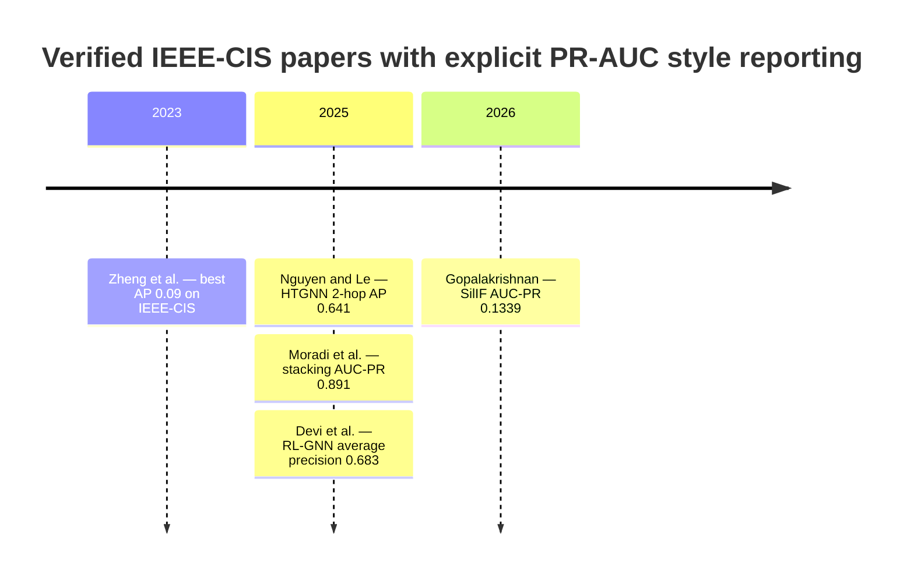

# IEEE-CIS Fraud Detection Studies That Explicitly Report PR-AUC

## Executive summary

The IEEE-CIS Fraud Detection benchmark on Kaggle is a 2019 real-world e-commerce transaction challenge from Vesta that has become a standard public benchmark for tabular fraud detection. In the fraud-detection literature built on this dataset, explicit reporting of **PR-AUC / AUC-PR / Average Precision** is still relatively uncommon; a 2025 systematic review found that AUC-PR or Average Precision appeared in only a small minority of the broader credit-card-fraud literature, despite its appropriateness for severe class imbalance. citeturn11search19turn9search9

Using a strict inclusion rule—**the paper must use the IEEE-CIS Kaggle dataset and explicitly report a precision–recall summary metric numerically**—I was able to verify **five papers from primary sources** with sufficiently exposed metrics and metadata for a rigorous related-work summary. Those five papers span unsupervised low-rank methods, graph-based temporal models, ensemble/tabular systems, reinforcement-learning-enhanced graph models, and an unsupervised augmentation of Isolation Forest. Their reported IEEE-CIS PR-style scores span roughly **0.09 to 0.891** in the fully verified set, with the strongest verified tabular result in this corpus coming from a feature-engineered stacking ensemble and the strongest verified graph result coming from a heterogeneous temporal GNN. citeturn33search0turn15search0turn21search2turn28search2turn8search4

I also surfaced several **probable additional matches**—including papers by Malik et al. (2022), Almalki and Masud (2025), Xu et al. (2025), Pandey et al. (2024), Roy et al. (2024), and Uddin and Aziz (2026)—that clearly mention IEEE-CIS and PR-oriented evaluation, but the accessible indexed text available here did **not** expose the exact IEEE-CIS PR-AUC/AP number cleanly enough for inclusion in the main verified corpus. I list those gaps explicitly in the limitations section rather than guessing. citeturn38search0turn23search3turn17search0turn11search1turn11search2turn22search15

## Scope and inclusion logic

This report includes only studies that satisfy all of the following conditions: they use the **IEEE-CIS Fraud Detection** dataset from Kaggle; they report a **numeric precision–recall summary metric** for that dataset; and the metric is explicitly described as **AUC-PR, PR-AUC, Average Precision, or Average Precision Score**. I treat **Average Precision / Average Precision Score** as a qualifying PR-curve summary metric when the source itself uses it that way; this is consistent with the 2025 systematic review, which explicitly groups **“AUC-PR (or Average Precision)”** together. citeturn11search19turn9search9

I prioritized **peer-reviewed conference and journal papers** first, then included **reputable preprints** only when the PR-oriented results were clearly exposed in the primary source. Where a paper uses a subset or modified sampling of IEEE-CIS rather than the full training table, I note that explicitly, because PR-style metrics are not directly comparable across full-benchmark, sampled, and temporally re-sliced protocols. citeturn28search6turn15search0turn8search4

## Verified corpus summary

All rows below are based on the cited **primary sources** in the last column.

| Year | Authors | Venue | PR-AUC / AP on IEEE-CIS | Model(s) | Code link | Primary source |
|---|---|---|---|---|---|---|
| 2023 | Jingjing Zheng; John Hawkin; Charles Robertson; Alexander J. M. Howse; Yuanzhu Chen; Xianta Jiang | Canadian AI 2023 | **Best AP = 0.09** for OP-ℓ1 / OP-ℓp / OP-ETP; baselines: LR 0.08, PCA 0.06, GMM 0.02, iForest 0.03, LOF 0.04, MAD 0.03, DBSCAN 0.03 | Unsupervised low-rank recovery / Outlier Pursuit variants | **Yes** — GitHub repo listed in paper | citeturn31search0turn31search3turn32search1turn33search0turn5search18 |
| 2025 | Hang Nguyen; Bac Le | ICAART 2025 | **AP = 0.641 ± 0.008** for HTGNN 2-hop; HTGNN 1-hop 0.611 ± 0.007; HTGNN 3-hop 0.591 ± 0.007; BRIGHT 0.371 ± 0.012; LGB 0.361 ± 0.025 | Heterogeneous Temporal Graph Neural Network | No public code surfaced in indexed source | citeturn15search0turn13search3 |
| 2025 | Fatemeh Moradi; Mehran Tarif; Mohammadhossein Homaei | ICCKE 2025 | **AUC-PR = 0.891** for complete-pipeline stacking ensemble; best individual XGBoost baseline reported as **0.834** | RF, XGBoost, LightGBM, stacking ensemble with feature engineering | No public code surfaced in indexed source | citeturn36search0turn21search2turn22search3turn23search4turn35search0turn36search4 |
| 2025 | R. Renuga Devi; Joseph Emerson Raja; Yeo Boon Chin | Scientific Reports | **Average Precision = 0.683** | RL-GNN fusion / context-aware community mining | No public code surfaced in indexed source | citeturn28search6turn28search2turn28search13turn26search4 |
| 2026 | Venkatakrishnan Gopalakrishnan | arXiv preprint | **AUC-PR = 0.1339** at α = 1.0; plain IF = 0.1259; Global K-Means = 0.145 | SilIF, a silhouette-augmented Isolation Forest | **Yes** — GitHub repo linked from arXiv abstract | citeturn8search4turn8search10turn34search2 |

## Detailed paper notes

**Zheng et al., “Unsupervised Financial Fraud Detection Using Low-rank Recovery,” Canadian Conference on Artificial Intelligence, 2023.** The accessible primary source identifies the full author list, the venue, and the DOI-equivalent publication identifier `10.21428/594757db.953eca4c`. The paper compares one supervised baseline and multiple unsupervised baselines on German Credit, TIC, and IEEE-CIS. On **IEEE-CIS**, the reported **Average Precision / Average Precision Score** row is: LR **0.08**, PCA **0.06**, GMM **0.02**, iForest **0.03**, LOF **0.04**, MAD **0.03**, DBSCAN **0.03**, OP-ℓ1 **0.09**, OP-ℓp **0.09**, and OP-ETP **0.09**. The corresponding ROC-AUC row on IEEE-CIS is LR **0.70**, PCA **0.61**, GMM **0.76**, iForest **0.72**, LOF **0.53**, MAD **0.61**, DBSCAN **0.50**, and OP variants **0.73**. Methodologically, the paper proposes **Outlier Pursuit** and non-convex variants solved with **ADMM + Generalized Accelerating Iterative Algorithm**, emphasizing unsupervised fraud detection under imbalance rather than resampling. The indexed text exposes code availability through a GitHub repository linked in the paper. The key limitation is performance: although the OP variants improve AP over most unsupervised baselines, the **best AP remains only 0.09**, so this is best read as a strong **unsupervised baseline paper**, not a state-of-the-art full-system detector. The indexed snippets do not expose an explicit IEEE-CIS train/test split or time-aware protocol. citeturn31search0turn31search2turn31search3turn32search1turn33search0turn5search18

**Nguyen and Le, “Real-Time Transaction Fraud Detection via Heterogeneous Temporal Graph Neural Network,” ICAART 2025, DOI `10.5220/0013161300003890`.** This paper constructs a **heterogeneous temporal graph** over transactions and related entities, then evaluates multiple hop settings of an HTGNN against **LightGBM** and the **BRIGHT** graph baseline. On **IEEE-CIS**, the paper reports **AP = 0.641 ± 0.008** and **AUC-ROC = 0.940 ± 0.010** for the best **HTGNN 2-hop** model, with inference latency **1.80 ± 0.013 ms**; the 1-hop and 3-hop variants score **0.611 ± 0.007** and **0.591 ± 0.007** AP, while BRIGHT and LGB score **0.371 ± 0.012** and **0.361 ± 0.025** AP. The training setup exposed in the indexed PDF snippet uses **Adam**, learning rate **1e-3**, weight decay **1e-4**, **dropout 0.2**, **10,000 epochs**, and **early stopping with patience 50**, run on a DGX server with four A100 GPUs. The paper clearly uses AP because the authors explicitly say they evaluate with **Average Precision**, **AUC-ROC**, and **prediction time**. The accessible text indicates a temporal framing from historical windows **T1…Tt** to a target window **Tt+1**, but the exact fold sizes are not exposed in the snippet. No public code link surfaced in the indexed sources I could verify. citeturn15search0turn13search3

**Moradi, Tarif, and Homaei, “Ensemble-Based Fraud Detection: A Robust Approach Evaluated on IEEE-CIS,” ICCKE 2025, DOI `10.1109/ICCKE68588.2025.11273852`.** This is the strongest fully verified **tabular/ensemble** paper in the corpus. The accessible conference and preprint sources show a final **stacking ensemble** with **AUC-ROC = 0.918** and **AUC-PR = 0.891** on IEEE-CIS, with the paper describing a **3.5% improvement in AUC-ROC** and **6.8% improvement in AUC-PR** over the best individual algorithm, identified in the indexed text as **XGBoost with 0.887 AUC-ROC and 0.834 AUC-PR**. Feature engineering is a major contribution: the authors report **80 engineered features** added to a **167-feature baseline**, producing a **247-feature complete pipeline**. Their ablation analysis says **temporal features** matter most, followed by **aggregation** and **interaction** features; the complete pipeline improves AUC-PR by **10.2 percentage points** over the baseline feature-only setup. The paper evaluates multiple ensemble families, including **Random Forest, XGBoost, LightGBM, and stacking**. The indexed sources show that the work is organized around the challenges of **extreme class imbalance, concept drift, and real-time requirements**, but the exact final resampling choice or split protocol is not exposed in the retrieved snippets. I did not find a public code repository in the indexed sources. For related work closest to a strong, reproducible **tabular benchmark paper on IEEE-CIS with explicit PR-AUC**, this is the closest verified match in the present corpus. citeturn36search0turn21search2turn22search3turn23search4turn35search0turn35search2turn36search4

**Devi, Raja, and Chin, “Reinforcement learning with graph neural network fusion for real-time financial fraud detection: a context-aware community mining approach,” Scientific Reports, 2025, DOI `10.1038/s41598-025-25200-3`.** This paper is a graph-heavy fraud detector that combines **community mining**, **graph neural networks**, and **reinforcement learning** for real-time detection. The indexed Nature/ResearchGate summaries report **Average Precision = 0.683**, **AUROC = 0.872**, **F1 = 0.839**, and **MCC = 0.54**, together with a **19.7% recall gain** and **33% reduction in false positives** relative to the compared GNN baselines. One important caveat is protocol: the accessible snippet explicitly says the implementation used **30,000 transactions from the IEEE-CIS dataset**, so this is not obviously the exact full-kaggle-train-table setup used in some other IEEE-CIS studies; it should therefore be compared cautiously with full-benchmark papers such as Moradi et al. and SilIF. The method stack uses **PyTorch Geometric** and **NetworkX**. I did not find public code in the indexed sources. As related work, this paper is most relevant if your project is graph-based, adaptive, or latency-sensitive rather than classic tabular boosting. citeturn28search6turn28search2turn28search13turn26search4

**Gopalakrishnan, “SilIF: Silhouette-Augmented Isolation Forest for Unsupervised Transaction Fraud Detection,” arXiv `2605.26135`, 2026.** SilIF augments **Isolation Forest** with a post-hoc **silhouette-based scoring layer** built from per-tree path-length fingerprints. On IEEE-CIS, the paper reports **AUC-PR = 0.1339** at the recommended **α = 1.0**, compared with **plain Isolation Forest = 0.1259**; the paper further notes **Global K-Means = 0.145** on the same benchmark, which slightly outperforms SilIF despite SilIF’s improvement over the IF base model. The indexed arXiv text also reports **+0.0080 AUC-PR** over plain IF across **5 seeds**, **5/5 wins**, and a paired **t-test p = 0.046**. The paper is unusually transparent about failure modes: on the second dataset (Sparkov), the silhouette augmentation does **not** help. The authors link a **GitHub repository** directly from the arXiv abstract. The indexed HTML discussion also offers a useful methodological interpretation: the authors argue that IEEE-CIS’s engineered features—such as counts, time deltas, and encoded categoricals—create multiple structural partitioning regimes that make the path-length fingerprint informative beyond the scalar average. If you need a recent **unsupervised/anomaly-detection** reference that explicitly foregrounds PR-AUC on IEEE-CIS, this is the most current verified example I found. citeturn8search4turn8search10turn34search0turn34search2

## Synthesis and timeline

Across the verified corpus, the field clusters into three method families. The first is **unsupervised anomaly detection**, represented by low-rank recovery and SilIF; these methods explicitly embrace label scarcity and typically report much lower PR-style scores on IEEE-CIS, with verified AP/AUC-PR values around **0.09 to 0.14**. The second is **graph-structured modeling**, represented by HTGNN and RL-GNN, where verified AP values rise to roughly **0.64 to 0.68**. The third is **feature-engineered tabular ensembles**, represented most clearly by Moradi et al., where a strong stacking pipeline reaches **AUC-PR = 0.891**. The large spread in scores reflects not only model class, but also different evaluation protocols, graph constructions, time framing, and in at least one case a sampled IEEE-CIS subset rather than the full benchmark. citeturn33search0turn15search0turn21search2turn28search2turn8search4

The most important methodological pattern is that **PR-AUC/AP reporting remains sparse relative to ROC-AUC**, even though severe class imbalance makes PR-oriented metrics more informative; the 2025 systematic review explicitly flags this imbalance in reporting. The most useful papers for “closest match” purposes depend on your method: **Moradi et al.** is the closest verified match for a strong **tabular supervised baseline with extensive feature engineering**; **Nguyen and Le** is the closest verified match for a **time-aware graph model with latency reporting**; **Zheng et al.** and **Gopalakrishnan** are the closest verified matches for **unsupervised/anomaly-detection** framing on IEEE-CIS. citeturn9search9turn21search2turn15search0turn31search0turn8search4

A clear gap in the literature is the lack of a **standardized, community-accepted temporal or out-of-time split** for IEEE-CIS papers that report PR-AUC. Several recent papers mention concept drift, distribution shift, or out-of-time testing, but indexed snippets often fail to expose the exact numerical IEEE-CIS PR-AUC or the exact split, making apples-to-apples comparison harder than it should be. Another gap is **reproducibility**: among the verified corpus, I could confirm code links only for the **low-rank recovery** paper and **SilIF**. citeturn11search1turn8search9turn17search0turn31search3turn8search10

## Open questions and limitations

The strict inclusion rule used here means that some papers that **very likely belong in a broader IEEE-CIS + PR-AUC bibliography** were not elevated into the main verified table because the indexed primary-source text available here did not expose the exact IEEE-CIS PR-AUC/AP number clearly enough. The most important examples are **Malik et al. (Mathematics 2022)**, which explicitly mentions AUC-PR and appears to discuss it on page 14; **Almalki and Masud (arXiv 2025)**, which clearly uses IEEE-CIS and discusses ROC/PR evaluation but whose indexed snippets surfaced ROC-AUC rather than a clean IEEE-CIS PR-AUC number; **Xu et al. (ACM 2025)**, which explicitly uses AUC-PR for IEEE-CIS but whose indexed snippets did not expose the exact value; **Pandey et al. (ACM 2024)** and **Roy et al. (ACM 2024)**, which both mention AUC-PR on IEEE-CIS in accessible snippets without surfacing the final IEEE-CIS number; and **Uddin and Aziz (arXiv 2026)**, which explicitly prioritizes PR-AUC on full IEEE-CIS but whose indexed snippets did not expose the final PR-AUC value numerically. citeturn38search0turn38search1turn23search3turn23search8turn17search0turn11search1turn11search2turn22search15turn37search0

There is also a comparability problem across the verified papers themselves. Some studies appear to use the **full benchmark**, some a **subset** of IEEE-CIS, some a **heterogeneous temporal graph framing**, and some unsupervised anomaly-detection setups with no clearly exposed temporal holdout in the indexed text. That means the reported PR-style numbers are extremely useful for related-work positioning, but they should not be treated as a unified leaderboard. In particular, the **0.891** from Moradi et al., the **0.641** from HTGNN, the **0.683** from RL-GNN, and the **0.1339** from SilIF are all informative, but not necessarily directly comparable without reconstructing each paper’s exact protocol. citeturn21search2turn15search0turn28search2turn8search4