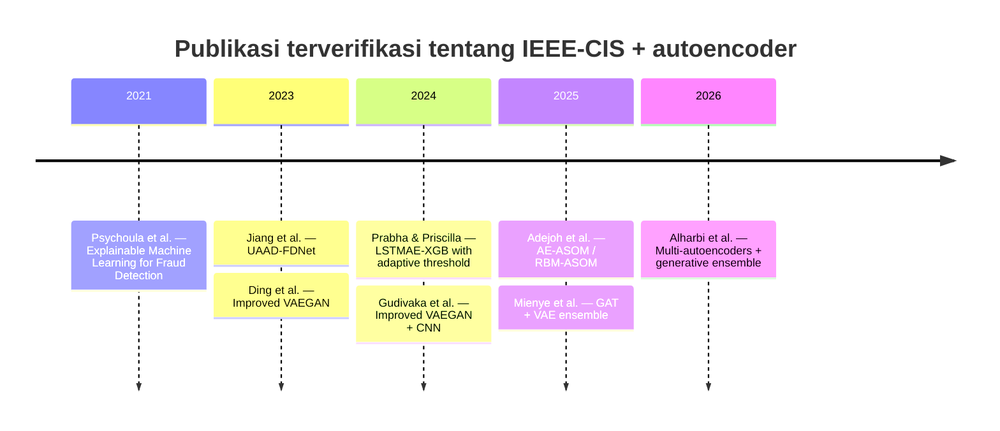

# Tinjauan Mendalam Paper Fraud Detection Berbasis Autoencoder pada Dataset IEEE-CIS Fraud Detection

## Ringkasan eksekutif

Berdasarkan penelusuran yang saya lakukan terhadap sumber primer dan sekunder yang paling relevan, saya menemukan **delapan karya yang dapat dimasukkan dengan keyakinan tinggi atau menengah** karena secara eksplisit memakai autoencoder atau variannya **dan** menggunakan dataset **IEEE-CIS Fraud Detection** setidaknya sebagai dataset eksperimen atau validasi. Korpus ini mencakup satu studi explainability awal yang memakai **vanilla autoencoder** sebagai model unsupervised, lalu bergeser cepat ke **hybrid autoencoder**: **attentional AE + GAN**, **VAE-GAN**, **LSTM autoencoder + XGBoost**, **AE-ASOM**, **VAE + GAT + XGBoost**, dan **multi-autoencoder + VAE-GAN + ensemble**. Secara kronologis, lonjakan publikasi yang benar-benar relevan untuk IEEE-CIS tampak mulai 2023 dan makin dominan pada arsitektur hibrida pada 2025–2026. citeturn17search0turn18search6turn1search10turn37view0turn24view0turn32view0turn18search3turn26search4

Pola terkuat di korpus ini adalah bahwa **autoencoder jarang dipakai sendirian sebagai detektor final**. Ia lebih sering dipakai sebagai salah satu dari tiga peran: **pembelajar representasi laten**, **generator/augmenter data fraud sintetis**, atau **anomaly scorer** yang kemudian di-fusion dengan classifier tabular/graph lain seperti XGBoost, LightGBM, CNN, atau GAT. Dengan kata lain, pada IEEE-CIS, AE bukan lagi sekadar “reconstruction model”, tetapi bagian dari pipeline hibrida yang mencoba menaklukkan tiga problem inti dataset ini: **imbalance**, **heterogenitas fitur**, dan **sparsitas/missingness**. citeturn18search6turn2view0turn37view0turn24view0turn32view0

Hasil terbaik yang terlihat dalam sumber yang dapat saya verifikasi **tidak sepenuhnya apple-to-apple**. Sebagian paper memakai split acak, sebagian menambahkan threshold tuning, sebagian melakukan augmentation sintetis, sebagian lagi memakai latent fusion dan ensemble. Karena itu, angka seperti **precision 0.942 / recall 0.905 / F1 0.923** pada model **LSTMAE-XGB dengan attention** atau **macro F1 0.8751 / macro AUC 0.9814** pada framework **multi-autoencoder + generative ensemble** harus dibaca dalam konteks protokol eksperimen masing-masing, bukan sebagai leaderboard absolut lintas paper. Bahkan paper paling rinci di 2026 sendiri mengakui keterbatasan evaluasi berbasis random train–test split dan menyarankan evaluasi time-aware/rolling-window untuk deployment nyata. citeturn40view0turn34view0turn35view4

Secara praktis, jika tujuan Anda adalah riset metodologis yang serius, **Jiang et al. 2023**, **Prabha & Priscilla 2024**, **Mienye et al. 2025**, dan **Alharbi et al. 2026** adalah empat titik jangkar terpenting, karena bersama-sama mereka menunjukkan evolusi dari **attentional anomaly detection**, ke **recurrent AE + thresholding**, ke **graph-augmented VAE**, lalu ke **multi-encoder generative ensembling**. Psychoula et al. tetap penting sebagai karya awal yang menunjukkan bagaimana **AE pada IEEE-CIS** dibaca dari lensa explainability, bukan hanya purity performance. citeturn18search6turn40view0turn24view0turn32view0turn17search0

## Cakupan, kriteria inklusi, dan timeline

Saya memasukkan paper jika memenuhi tiga syarat: karya akademik primer atau preprint akademik; **secara eksplisit** menyebut **autoencoder** atau variannya; dan **secara eksplisit** menggunakan **IEEE-CIS Fraud Detection** sebagai dataset eksperimen, generalization dataset, atau dataset evaluasi silang. Dengan kriteria ini, saya **tidak** memasukkan beberapa paper autoencoder lain yang populer dalam fraud detection tetapi dari korpus yang dapat saya verifikasi ternyata terutama memakai dataset Eropa/Santander/non-IEEE-CIS. Saya juga memisahkan kandidat yang **mungkin** relevan namun tidak dapat saya verifikasi penuh dari metadata sumber primer yang tersedia. citeturn14view0turn9view0turn23search0turn32view0

Dataset IEEE-CIS sendiri adalah dataset transaksi e-commerce dari kompetisi Kaggle IEEE-CIS Fraud Detection, lazim juga disebut dataset **Vesta**, dengan **590.540** transaksi, sekitar **20.663** fraud, dan ratusan fitur tabular yang mencakup atribut transaksi, identitas, waktu relatif, dan kategori. Beberapa paper di korpus menggabungkan tabel identity dan transaction lewat **TransactionID**, lalu melakukan encoding kategorikal, scaling numerik, dan imputasi missing values karena dataset ini jauh lebih heterogen daripada benchmark PCA-anonymized klasik. citeturn17search19turn39view0turn35view3

## Bacaan prioritas yang saya rekomendasikan

**Jiang et al. 2023, _Credit Card Fraud Detection Based on Unsupervised Attentional Anomaly Detection Network_**. Ini bacaan pertama yang paling penting jika Anda ingin melihat versi “serius” dari autoencoder unsupervised pada IEEE-CIS yang tidak berhenti di reconstruction error biasa, tetapi menambahkan **feature attention** dan **GAN** ke dalam kerangka anomaly detection. Keunggulan paper ini adalah detail training yang relatif jelas di metadata yang dapat diakses: **PyTorch**, **Adam**, **learning rate 0.01 untuk IEEE-CIS**, **batch size 256**, dan hingga **100 epoch**, plus daftar baseline yang luas. citeturn18search6turn40view0

**Prabha & Priscilla 2024, _A combined framework based on LSTM autoencoder and XGBoost with adaptive threshold classification for credit card fraud detection_**. Ini paper yang sangat berguna bila Anda ingin framework yang relatif mudah direplikasi: **LSTM autoencoder → latent features → XGBoost → threshold tuning berbasis F1**. Paper ini juga paling jelas dalam melaporkan hasil IEEE-CIS pada berbagai threshold, termasuk perbandingan langsung terhadap **XGB**, **AE-XGB**, dan **LSTMAE-XGB** tanpa attention. citeturn37view0turn40view0

**Alharbi et al. 2026, _Imbalance-Aware Credit Card Fraud Detection Using Multi-Autoencoders and Generative Ensemble Learning_**. Ini adalah karya paling matang secara teknik dalam korpus saya karena memberi detail preprocessing IEEE-CIS, latent dimensions, optimizer, learning rate, epoch, batch size, strategi threshold search, dan pembacaan limitation yang jujur. Jika Anda ingin peta state-of-the-art modern untuk “AE sebagai latent backbone + generative augmenter + ensemble decision layer”, paper ini wajib dibaca. citeturn32view0turn35view3turn34view1turn34view0

**Mienye et al. 2025, _Detecting Imbalanced Credit Card Fraud via Hybrid Graph Attention and Variational Autoencoder Ensembles_**. Saya merekomendasikan ini karena ia menunjukkan arah penting yang kini makin dominan: **feature-level anomaly** dari **VAE** digabung dengan **relational learning** dari **GAT**. Untuk IEEE-CIS, arah ini sangat masuk akal karena dataset kaya fitur identitas dan relasi transaksi, bukan sekadar vektor tabular datar. citeturn24view0

**Psychoula et al. 2021/2022, _Explainable Machine Learning for Fraud Detection_**. Dari sisi performa murni, ini bukan yang paling kuat. Namun untuk riset akademik, paper ini berharga karena menunjukkan bagaimana **AE pada IEEE-CIS** diletakkan dalam diskusi **explainability**, reliability of explanations, dan trade-off antara model supervised vs unsupervised. Jika riset Anda ingin lebih dari sekadar F1 dan AUC, paper ini adalah konteks awal yang sangat baik. citeturn17search0turn6search0

## Perbandingan lintas paper

| Paper | Tahun, venue, DOI/tautan | Tipe AE | Cara memakai IEEE-CIS | Split & preprocessing | Arsitektur & hiperparameter | Prosedur training | Metrik & hasil IEEE-CIS | Baseline/comparison | Kode |
|---|---|---|---|---|---|---|---|---|---|
| **Psychoula et al., _Explainable Machine Learning for Fraud Detection_** | 2021 arXiv; versi chapter Springer 2022; DOI chapter **10.1007/978-3-031-04083-2_8** citeturn17search0turn6search0 | Vanilla AE | Dipakai sebagai model unsupervised pada IEEE-CIS untuk studi fraud explainability. citeturn17search0 | Detail split/preprocessing AE **unspecified** pada cuplikan yang saya akses; paper menyebut fraud ratio IEEE-CIS sekitar **3,49%**. citeturn17search0 | Arsitektur AE & hiperparameter **unspecified** dalam cuplikan aksesibel. citeturn17search0turn6search0 | Membandingkan model supervised dan unsupervised; fokus pada performa, reliability of explanation, dan runtime. citeturn17search0 | Angka hasil AE spesifik pada IEEE-CIS **unspecified** dalam cuplikan aksesibel. citeturn17search0 | Baseline supervised & unsupervised lain, namun daftar lengkap model pada cuplikan aksesibel **unspecified**. citeturn17search0 | Tidak ditemukan repo khusus pada sumber yang saya akses. |
| **Jiang et al., _Credit Card Fraud Detection Based on Unsupervised Attentional Anomaly Detection Network_** | 2023, *Systems* 11(6):305; DOI tidak terlihat eksplisit pada cuplikan, sumber primer MDPI tersedia via sitasi. citeturn18search6 | Hybrid AE + feature attention + GAN | IEEE-CIS dipakai sebagai dataset generalisasi selain benchmark Kaggle CCFD. citeturn18search6 | Transaction dan identity di-*join* via **TransactionID**; file IEEE-CIS dijelaskan; split rinci tidak terlihat, tetapi training setting untuk IEEE-CIS dilaporkan. citeturn18search6 | Framework **UAAD-FDNet**: autoencoder dengan **Feature Attention** dan GAN; skor fraud memakai hidden vector + distance antara input dan rekonstruksi dalam feature space. Untuk IEEE-CIS: **Adam**, **lr 0,01**, **batch 256**, **maks 100 epoch**, PyTorch, RTX 2080Ti. citeturn18search6 | Trained hingga convergence; anomaly-detection framing, bukan classifier supervised murni. citeturn18search6 | Sumber primer menyatakan metode mengungguli baseline di IEEE-CIS; angka tabel IEEE-CIS tidak tampak dalam cuplikan. Sumber sekunder pada paper 2024 mengutip **precision 0,93 / recall 0,63 / F1 0,73**. citeturn18search6turn40view0 | SVM, DT, XGBoost, KNN, RF, LSTM, CNN, MLP, AE. citeturn18search6 | Tidak ditemukan repo khusus pada sumber yang saya akses. |
| **Ding et al., _Credit Card Fraud Detection Based on Improved Variational Autoencoder Generative Adversarial Network_** | 2023; venue/DOI tidak terlihat eksplisit pada cuplikan primer yang saya akses. citeturn1search10turn2view0 | Improved VAE-GAN | Menguji pada European dataset dan **IEEE-CIS**. citeturn1search10 | Split dan preprocessing **unspecified** pada cuplikan aksesibel. citeturn1search10turn2view0 | Bagian generator **VAEGAN** diperbaiki; diusulkan metode oversampling baru berbasis improved VAEGAN; hasil data diperluas lalu diklasifikasi memakai **CNN**. Hiperparameter **unspecified**. citeturn2view0 | Pipeline adalah augmentation sintetis minority class lalu klasifikasi. citeturn2view0 | Paper menyatakan performa lebih baik daripada metode pembanding pada European dan IEEE-CIS, tetapi angka persis IEEE-CIS tidak terlihat pada cuplikan aksesibel. citeturn1search10turn2view0 | Dibandingkan dengan SMOTE, DNN tradisional, dan oversampling berbasis GAN dalam pembahasan sekunder; daftar presisi primer yang bisa diverifikasi terbatas. citeturn2view0 | Tidak ditemukan repo khusus pada sumber yang saya akses. |
| **Prabha & Priscilla, _A combined framework based on LSTM autoencoder and XGBoost with adaptive threshold classification for credit card fraud detection_** | 2024, *The Scientific Temper* 15(2):2216–2224, DOI **10.58414/SCIENTIFICTEMPER.2024.15.2.34**. citeturn37view0 | Recurrent / LSTM autoencoder + attention | Dataset utama adalah **IEEE-CIS dari Kaggle**. citeturn37view0turn39view0 | Identity dan transaction di-*join* via **TransactionID**; **590.540** transaksi dan **433** fitur setelah penggabungan; paper menyatakan menghapus fitur tak penting, tetapi split numerik train/test tidak disebutkan. citeturn39view0 | **LSTMAE** dengan **attention** di encoder, **dropout**, **RepeatVector**; latent codes masuk ke **XGBoost**; optimizer **Adam**; loss **binary cross-entropy**; learning rate, batch size, epoch, early stopping disebut, tetapi nilainya **unspecified**. Threshold optimal: XGB **0,24**, AE-XGB **0,30**, LSTMAE-XGB **0,28**, LSTMAE-XGB+attention **0,22**. citeturn39view1turn40view0 | Train LSTMAE pada training set, latents dipakai untuk melatih XGBoost, lalu threshold dipilih dengan memaksimalkan F1. citeturn39view1 | Pada threshold optimal **0,22**, model attention mencapai **precision 0,942**, **recall 0,905**, **F1 0,923**, **G-mean 0,940**, **MCC 0,891**, **balanced accuracy 0,941**. citeturn40view0 | XGB, AE-XGB, LSTMAE-XGB; paper juga membandingkan terhadap AdaBoost, GBM, RF, CatBoost, LGBM, dan studi IEEE-CIS sebelumnya. citeturn40view0turn39view2 | Tidak ditemukan repo khusus pada sumber yang saya akses. |
| **Gudivaka et al., _An Improved Variational Autoencoder Generative Adversarial Network with Convolutional Neural Network for Fraud Financial Transaction Detection_** | 2024, *2024 Second International Conference on Data Science and Information System*; DOI **10.1109/ICDSIS61070.2024.10594271**. citeturn42search1 | VAE-GAN + CNN | Metadata konferensi menyebut eksperimen dilakukan pada **IEEE-CIS Fraud Detection Dataset**. citeturn26search4 | Split/preprocessing **unspecified** pada metadata aksesibel. citeturn42search1turn26search4 | Improved **VAEGAN** yang dipasangkan dengan **CNN** untuk klasifikasi fraud. Hiperparameter **unspecified**. citeturn42search1 | Kombinasi oversampling generatif dan CNN classifier. citeturn42search1 | Metadata sekunder untuk paper ini melaporkan **accuracy 99,78%**, **precision 88,97%**, **recall 95,24%**, **F1 95,00%**. citeturn42search1 | Disebut mengungguli CNN, LightGBM, dan LSTM ensemble. citeturn42search1 | Tidak ditemukan repo khusus pada sumber yang saya akses. |
| **Adejoh et al., _An Adaptive Unsupervised Learning Approach for Credit Card Fraud Detection_** | 2025, *Big Data and Cognitive Computing* 9(9):217, DOI **10.3390/bdcc9090217**. citeturn22search0turn22search15 | AE-ASOM; juga RBM-ASOM | Paper menyatakan model dilatih pada Kaggle Credit Card Fraud Detection dan **dievaluasi menggunakan IEEE-CIS**. Jadi ini **cross-dataset use**, bukan murni train-on-IEEE. citeturn18search3turn22search0 | Split/preprocessing **unspecified** pada metadata yang saya akses. citeturn22search0turn22search3 | Dua model adaptif: **AE-ASOM** dan **RBM-ASOM**; threshold adaptif diatur melalui sifat klaster SOM. Hiperparameter **unspecified**. citeturn22search3turn22search4 | Unsupervised anomaly detection + adaptive SOM thresholding. citeturn22search3turn22search4 | Metadata abstrak melaporkan **AE-ASOM accuracy 0,980, F1 0,967** dan **RBM-ASOM accuracy 0,975, F1 0,955** pada evaluasi atas Kaggle+IEEE-CIS; namun angka khusus untuk subset IEEE-CIS tidak terpisah di cuplikan aksesibel. citeturn22search3turn22search4 | Dibandingkan dengan One-Class SVM dan Isolation Forest; paper juga menekankan false positive rate lebih rendah. citeturn22search3turn22search4 | Tidak ditemukan repo khusus pada sumber yang saya akses. |
| **Mienye, Esenogho, Modisane, _Detecting Imbalanced Credit Card Fraud via Hybrid Graph Attention and Variational Autoencoder Ensembles_** | 2025, *AppliedMath* 5(4):131, DOI **10.3390/appliedmath5040131**. citeturn24view0 | VAE + GAT + stacking XGBoost | Menguji pada **European Credit Card** dan **IEEE-CIS Fraud Detection**. citeturn24view0 | Pada cuplikan aksesibel, detail split IEEE-CIS, preprocessing, dan hyperparameter **unspecified**. citeturn24view0 | Menggabungkan **VAE** untuk probabilistic anomaly detection, **Graph Attention Network** untuk inter-transaction relationships, dan **stacking ensemble dengan XGBoost**. citeturn24view0 | VAE anomaly scores dan GAT embeddings digabung dalam ensemble untuk prediksi robust. citeturn24view0 | Abstrak menyatakan paper mengungguli baseline **hingga 15% F1**, dengan **F1 di atas 0,980** dan **AUC hingga 0,995** pada dua dataset; angka IEEE-CIS spesifik tidak tampak di cuplikan yang saya akses. citeturn24view0 | Melawan berbagai baseline model; daftar lengkap di cuplikan aksesibel **unspecified**. citeturn24view0 | Tidak ditemukan repo khusus pada sumber yang saya akses. |
| **Alharbi, Alahmadi, Wang, _Imbalance-Aware Credit Card Fraud Detection Using Multi-Autoencoders and Generative Ensemble Learning_** | 2026, *Expert Systems* 43(5):e70256, DOI **10.1111/exsy.70256**. citeturn32view0 | Multi-autoencoders + label-conditioned VAE-GAN + ensemble | IEEE-CIS dipakai sebagai eksperimen tambahan untuk validasi generalisasi. citeturn32view0 | Untuk IEEE-CIS: sekitar **590k** transaksi, rasio fraud **~3,5%**; **frequency encoding** untuk fitur kategorikal, **z-score scaling** untuk numerik, **median imputation** untuk numerik, kategori khusus untuk missing kategorikal; **stratified 80/20 split**; augmentasi hanya pada train set. citeturn35view3 | Tiga autoencoder laten: **16D** (classification AE), **50D** (visualization AE), **32D** (hybrid AE); generator independen pada ruang laten 16D/32D/50D disatukan menjadi **98D**; **GAN noise 64**, **Fusion CNN** sebagai layer downstream; optimizer **Adam**. Hyperparameter: Classification AE lr **0,001**, epochs **80**, batch **256**; Visualization AE lr **0,001**, **80**, **256**; Hybrid AE lr **0,0008**, **80**, **256**; GAN lr **0,0002**, **400**, batch **32**, β1=**0,5**; Fusion CNN lr **0,0008**, **60**, batch **256**. citeturn33view1turn34view1 | Threshold dicari di rentang **[0,05, 0,95]** untuk memaksimalkan **Macro F1**; Fusion CNN terbaik pada **0,77**, Naive Bayes pada **0,10**. citeturn34view1 | Pada IEEE-CIS, **Intelligent-Ensemble** di data GAN-augmented mencapai **Macro F1 0,8751**, **Balanced Accuracy 0,8262**, **Macro AUC 0,9814**; XGBoost adalah baseline individual terkuat. citeturn34view0turn36view0turn36view2 | Dibandingkan terhadap baseline individual, metode berbasis SMOTE, dan hybrid fraud detection SOTA; LightGBM, KNN, Meta-Ensemble, Intelligent-Ensemble dibahas eksplisit. citeturn34view0turn34view2 | Tidak ditemukan repo khusus pada sumber yang saya akses. |

## Ulasan rinci per paper

### Psychoula et al.

**Sitasi yang disarankan:** Ismini Psychoula dkk., *Explainable Machine Learning for Fraud Detection*, arXiv:2105.06314 (2021); versi peer-reviewed chapter terbit tahun 2022 dengan DOI **10.1007/978-3-031-04083-2_8**. Paper ini menggunakan IEEE-CIS sebagai case study explainability, menyebut fraud ratio sekitar 3,49%, dan membandingkan model supervised serta unsupervised, termasuk autoencoder, dari sudut akurasi, reliability of explanation, dan runtime. Kontribusi utamanya bukan arsitektur AE baru, tetapi memperlihatkan bagaimana model AE pada data fraud yang sangat imbalanced berinteraksi dengan layer explainability; sayangnya, pada cuplikan sumber yang bisa saya akses, detail arsitektur AE dan angka hasil spesifik untuk AE tidak tampak. citeturn17search0turn6search0

Dari perspektif riset, paper ini layak dibaca bukan untuk mengejar SOTA, melainkan untuk memahami apa yang hilang bila kita menilai model AE hanya dari F1/AUC. Ia memberikan konteks bahwa di domain fraud, especially pada IEEE-CIS yang heterogen dan high-stakes, pertanyaan “mengapa ini fraud?” bisa sama pentingnya dengan “berapa tinggi recall-nya?”. Keterbatasannya, jika tujuan Anda adalah reproduksi engineering, adalah detail teknis AE yang di cuplikan saya akses tetap minimal. citeturn17search0

### Jiang et al.

**Sitasi yang disarankan:** Jiang, S., dkk., *Credit Card Fraud Detection Based on Unsupervised Attentional Anomaly Detection Network*, *Systems* 11(6):305, 2023. Paper ini mengusulkan **UAAD-FDNet**, yakni kerangka anomaly detection tak terawasi yang menggabungkan **autoencoder**, **Feature Attention**, dan **GAN**, lalu menghitung hidden representation serta jarak rekonstruksi untuk memutuskan apakah transaksi adalah fraud. Di sumber primer yang saya akses, paper ini secara eksplisit menyebut penggunaan **PyTorch**, **RTX 2080Ti**, **Adam**, **batch size 256**, **maksimum 100 epoch**, dan **learning rate 0,01 untuk IEEE-CIS**. Baseline yang dipakai juga luas: SVM, DT, XGBoost, KNN, RF, LSTM, CNN, MLP, dan AE. citeturn18search6

Untuk IEEE-CIS, nilai tabel primer tidak seluruhnya terlihat di cuplikan yang dapat saya buka, sehingga saya berhati-hati: yang dapat saya pastikan dari sumber primer adalah bahwa paper mengklaim unggul atas metode fraud detection lain pada IEEE-CIS. Jika Anda butuh satu angka pembanding praktis, paper 2024 oleh Prabha & Priscilla mengutip performa **UAAD-FDNet w/FA** di IEEE-CIS sekitar **precision 0,93**, **recall 0,63**, **F1 0,73**. Saya menandai angka ini sebagai **kutipan sekunder**, bukan ekstraksi langsung dari tabel primer Jiang. citeturn18search6turn40view0

### Ding et al.

**Sitasi yang disarankan:** Ding dkk., *Credit Card Fraud Detection Based on Improved Variational Autoencoder Generative Adversarial Network*, 2023. Dari sumber primer yang saya akses, karya ini secara eksplisit menggunakan **European dataset** dan **IEEE-CIS Fraud Detection**. Arsitekturnya meningkatkan bagian generator dari **VAE-GAN**, lalu memakai hasil oversampling berbasis improved VAEGAN untuk memperluas data sebelum klasifikasi dengan **CNN**. Dengan kata lain, VAE di sini tidak dipakai sebagai detektor mandat tunggal, tetapi sebagai mesin generatif untuk memperbaiki representasi fraud minority class. citeturn1search10turn2view0

Kelemahan besar untuk peneliti yang ingin replikasi adalah bahwa metadata primer yang dapat saya akses tidak menampilkan split, preprocessing terperinci, konfigurasi CNN, ataupun angka lengkap IEEE-CIS. Karena itu, paper ini saya nilai penting secara konseptual—karena menunjukkan lini evolusi **VAE → VAE-GAN → fraud oversampling**—tetapi kurang ideal sebagai satu-satunya titik awal implementasi. citeturn2view0turn1search10

### Prabha dan Priscilla

**Sitasi lengkap:** D. Padma Prabha dan C. Victoria Priscilla, *A combined framework based on LSTM autoencoder and XGBoost with adaptive threshold classification for credit card fraud detection*, *The Scientific Temper*, 15(2):2216–2224, 2024, DOI **10.58414/SCIENTIFICTEMPER.2024.15.2.34**. Paper ini salah satu yang paling operasional: mereka menggabungkan **LSTM autoencoder**, **attention**, dan **XGBoost**, lalu memilih **threshold optimal** dengan memaksimalkan **F1-score**. IEEE-CIS dibangun dengan menggabungkan file identity dan transaction melalui **TransactionID**, menghasilkan **590.540 transaksi** dan **433 fitur** setelah penggabungan; paper juga menyebut penghapusan fitur yang dianggap tidak penting, meski daftar pastinya tidak ditampilkan. citeturn37view0turn39view0

Detail training yang tampak pada paper ini cukup jelas secara struktural walau tidak semua angkanya dibuka: autoencoder dibangun dengan **LSTM + attention layer + dropout + RepeatVector**, memakai **Adam** dan **binary cross-entropy**, serta threshold final berbeda untuk setiap model. Hasil IEEE-CIS paling penting ada pada model **LSTMAE-XGB with attention** dengan threshold **0,22**: **precision 0,942**, **recall 0,905**, **F1 0,923**, **G-mean 0,940**, **MCC 0,891**, dan **balanced accuracy 0,941**. Dibandingkan **AE-XGB** biasa, penambahan LSTM + attention + threshold tuning memberi kenaikan yang nyata pada recall dan F1. Paper ini juga berguna karena memberikan tabel komparatif ke studi IEEE-CIS sebelumnya. citeturn40view0

Keterbatasannya adalah hal yang sering berulang di literatur fraud tabular: paper menyebut learning rate, batch size, epoch, dan early stopping dipakai, tetapi **nilainya tidak dicantumkan** pada cuplikan yang dapat saya akses, dan split train/test persisnya juga tidak dibuka. Jadi paper ini sangat baik untuk memahami recipe model, tetapi masih membutuhkan kehati-hatian jika Anda ingin exact reproduction. citeturn39view1turn41view2turn41view3

### Gudivaka et al.

**Sitasi lengkap:** Basava Ramanjaneyulu Gudivaka dkk., *An Improved Variational Autoencoder Generative Adversarial Network with Convolutional Neural Network for Fraud Financial Transaction Detection*, dalam *2024 Second International Conference on Data Science and Information System (ICDSIS)*, DOI **10.1109/ICDSIS61070.2024.10594271**. Ini adalah paper konferensi yang cukup langsung: improved **VAEGAN** + **CNN** untuk fraud detection; metadata sumber menyebut bahwa eksperimen dijalankan pada **IEEE-CIS Fraud Detection Dataset**. citeturn42search1turn26search4

Bagi pembaca yang sedang membandingkan performa, paper ini menarik karena metadata yang saya akses melaporkan angka yang kuat: **accuracy 99,78%**, **precision 88,97%**, **recall 95,24%**, dan **F1 95,00%**, sambil menyatakan unggul atas **CNN**, **LightGBM**, dan **LSTM ensemble**. Namun saya harus menekankan bahwa untuk paper ini saya **tidak memperoleh full methods section**, sehingga split, preprocessing, dan hyperparameter tetap **unspecified** pada hasil riset saya. Itu membuat paper ini bernilai sebagai referensi performa dan arsitektur, tetapi bukan yang paling transparan untuk audit replikasi. citeturn42search1turn26search4

### Adejoh et al.

**Sitasi lengkap:** John Adejoh dkk., *An Adaptive Unsupervised Learning Approach for Credit Card Fraud Detection*, *Big Data and Cognitive Computing* 9(9):217, 2025, DOI **10.3390/bdcc9090217**. Paper ini unik di korpus karena **bukan murni train-on-IEEE-CIS**. Modelnya dilatih pada Kaggle Credit Card Fraud Detection dataset dan **dievaluasi menggunakan IEEE-CIS** sebagai pengujian generalisasi silang. Karena pertanyaan Anda adalah “paper yang melakukan fraud detection menggunakan dataset IEEE-CIS”, saya tetap memasukkannya, tetapi saya tandai dengan jelas sebagai **cross-dataset validation**, bukan penggunaan tunggal IEEE-CIS selama fitting utama. citeturn18search3turn22search0

Dua model yang diusulkan adalah **AE-ASOM** dan **RBM-ASOM**, yakni integrasi **Autoencoder** atau **Restricted Boltzmann Machine** dengan **Adaptive Self-Organizing Maps** untuk thresholding yang dinamis. Metadata abstraknya menyebut **AE-ASOM accuracy 0,980, F1 0,967** dan **RBM-ASOM accuracy 0,975, F1 0,955**, sambil menekankan keunggulan atas **One-Class SVM** dan **Isolation Forest** serta false positive rate yang lebih rendah. Tetapi angka ini disajikan untuk evaluasi atas dua dataset dan **tidak dipisah khusus untuk IEEE-CIS** dalam cuplikan yang saya akses. Jadi paper ini relevan kuat dari sisi metodologis, tetapi detail IEEE-CIS-nya masih parsial. citeturn22search3turn22search4

### Mienye et al.

**Sitasi lengkap:** Ibomoiye Domor Mienye, Ebenezer Esenogho, dan Cameron Modisane, *Detecting Imbalanced Credit Card Fraud via Hybrid Graph Attention and Variational Autoencoder Ensembles*, *AppliedMath* 5(4):131, 2025, DOI **10.3390/appliedmath5040131**. Paper ini menurut saya salah satu yang paling penting secara tren ilmiah: ia menggabungkan **VAE** untuk menangkap anomaly score dan latent irregularities dengan **GAT** untuk menangkap **relasi antar transaksi**, lalu mem-fuse keduanya dalam **stacking ensemble dengan XGBoost**. Untuk dataset seperti IEEE-CIS yang kaya fitur identitas dan relasi transaksi, arah ini sangat relevan. citeturn24view0

Dari abstrak yang dapat saya akses, paper ini mengklaim mengungguli baseline sampai **15% di F1**, dengan **F1 di atas 0,980** dan **AUC hingga 0,995** pada European Credit Card dan IEEE-CIS. Namun versi sumber yang saya akses hanya memberi abstrak dan tidak menampilkan tabel IEEE-CIS secara rinci, sehingga split, preprocessing khusus IEEE-CIS, dan hyperparameter tetap **unspecified** dalam hasil ekstraksi saya. Saya tetap memasukkannya karena keterkaitan paper ke IEEE-CIS dan VAE sangat eksplisit, tetapi untuk komparasi numerik ketat, paper ini memerlukan pembacaan full text lengkap. citeturn24view0

### Alharbi et al.

**Sitasi lengkap:** Sultan Alharbi, Khalid Alahmadi, dan Xianzhi Wang, *Imbalance-Aware Credit Card Fraud Detection Using Multi-Autoencoders and Generative Ensemble Learning*, *Expert Systems* 43(5):e70256, 2026, DOI **10.1111/exsy.70256**. Inilah paper paling rinci yang saya temukan untuk IEEE-CIS. Framework-nya bertahap: **tiga autoencoder** untuk latent representations (**16D**, **32D**, **50D**), lalu **label-conditioned VAE-GAN** untuk menghasilkan fraud sintetis pada tiap ruang laten, kemudian latent yang diperkaya diproyeksikan ke **98D fusion space**, dan akhirnya diputuskan lewat **Intelligent-Ensemble** serta **Meta-Ensemble**. citeturn32view0turn33view1

Bagian IEEE-CIS paper ini sangat berguna untuk peneliti. Mereka menjelaskan bahwa dataset berisi sekitar **590 ribu transaksi** dengan fraud sekitar **3,5%**; fitur kategorikal dienkode dengan **frequency encoding**, fitur numerik dinormalisasi dengan **z-score**, missing numerik diimputasi dengan **median**, missing kategorikal diberi **kategori khusus**, lalu dilakukan **stratified 80/20 split** dan **augmentation hanya di training set** untuk mencegah leakage. Implementasi dijalankan pada **NVIDIA A2 GPU**, dengan TensorFlow/Keras untuk komponen deep learning dan LightGBM/XGBoost/scikit-learn untuk baseline klasik. citeturn35view3

Yang paling bernilai adalah hyperparameter yang dibuka: **Classification AE** memakai Adam, **lr 0,001**, **80 epoch**, **batch 256**; **Visualization AE** juga **0,001/80/256**; **Hybrid AE** memakai **0,0008/80/256**; **GAN** memakai noise **64**, **Adam β1=0,5**, **lr 0,0002**, **400 epoch**, **batch 32**; dan **Fusion CNN** memakai **0,0008/60/256**. Threshold dipilih melalui pencarian di **[0,05, 0,95]** untuk memaksimalkan **Macro F1**. Pada IEEE-CIS, **Intelligent-Ensemble** pada data GAN-augmented mencapai **Macro F1 0,8751**, **Balanced Accuracy 0,8262**, dan **Macro AUC 0,9814**, sementara **XGBoost** adalah baseline individual terkuat. Yang juga saya hargai dari paper ini adalah kejujurannya: mereka mengakui overhead komputasi, potensi **generative bias**, dan kelemahan penggunaan **random train–test split** untuk problem fraud yang pada praktiknya bersifat temporal. citeturn34view1turn34view0turn36view0turn35view4

## Sintesis analitis

Jika saya kompres seluruh korpus ini ke dalam beberapa tesis penelitian, tesis pertama adalah bahwa **vanilla autoencoder murni hampir tidak lagi menjadi titik akhir** dalam literatur IEEE-CIS terbaru. Ia berevolusi menjadi komponen dari sistem yang lebih besar: AE untuk representasi, VAE/VAE-GAN untuk augmentasi sintetik, LSTM-AE untuk urutan/semu-urutan fitur, atau AE/VAE untuk anomaly score yang lantas digabung dengan graph/boosting/ensemble layer. Pergeseran itu tampak jelas dari transisi Psychoula 2021 ke Jiang 2023, kemudian ke Prabha 2024, Mienye 2025, dan Alharbi 2026. citeturn17search0turn18search6turn40view0turn24view0turn32view0

Tesis kedua adalah bahwa **IEEE-CIS memaksa autoencoder menjadi “tabular-aware” dan “heterogeneity-aware”**. Pada European cardholder benchmark yang PCA-anonymized, banyak paper dapat lolos dengan latent compression sederhana. Pada IEEE-CIS, justru paper yang tampak lebih kuat adalah paper yang secara eksplisit menangani **high-cardinality categorical features**, **identity fields**, **sparsity**, dan **missingness**, seperti frequency encoding + z-score + dedicated missing category pada Alharbi 2026, atau fusion dengan graph structure pada Mienye 2025. Ini menjelaskan mengapa hasil yang tinggi sering datang dari **hybrid latent + ensemble** ketimbang AE rekonstruksi sederhana. citeturn35view3turn24view0turn32view0

Tesis ketiga adalah bahwa literatur ini masih memiliki **defisit reproduksibilitas**. Bahkan pada paper-paper yang menarik secara metodologis, sering kali split temporal tidak dipakai, random seed tidak dipublikasikan, hyperparameter tidak lengkap, dan kode tidak ditautkan. Ini bukan keluhan kecil: pada fraud detection, perbedaan threshold, split train/test, atau kebocoran preprocessing dapat mengubah F1/recall secara dramatis. Karena itu, hasil setinggi paper konferensi 2024 atau model threshold-tuned 2024 perlu dipandang sebagai **hasil protokol tertentu**, bukan kebenaran universal tentang superioritas arsitektur. citeturn40view0turn35view4turn42search1

Tesis keempat adalah bahwa **recall-sensitivity terhadap fraud** tetap menjadi objective tersembunyi yang paling sering mengarahkan desain model, bahkan ketika paper melaporkan banyak metrik lain. Paper Prabha & Priscilla 2024 menyatakannya terang-terangan; Jiang 2023 merumuskan masalah sebagai anomaly detection; Alharbi 2026 mengevaluasi macro F1 dan macro AUC karena class imbalance ekstrem; dan Adejoh 2025 fokus pada adaptive thresholding untuk menekan false positive sambil menjaga deteksi fraud. Ini berarti jika riset Anda ingin membandingkan paper secara adil, saya sarankan jangan cuma mengumpulkan accuracy/F1, tetapi juga bedakan mana paper yang diam-diam dioptimasi untuk **recall**, mana yang dioptimasi untuk **macro PR behavior**, dan mana yang lebih condong ke **ranking quality/AUC**. citeturn39view2turn18search6turn34view0turn22search3

## Dataset, kode, dan pertanyaan terbuka

Untuk dataset, seluruh korpus ini merujuk pada kompetisi **Kaggle IEEE-CIS Fraud Detection**, sering juga disebut dataset **Vesta**. Secara umum ia memiliki sekitar **590.540** transaksi, sekitar **20.663** fraud, dan ratusan fitur transaksi-identitas yang membuatnya jauh lebih realistis dan menantang daripada benchmark Eropa lama. Selain paper-paper di atas, halaman kompilasi **past solutions** untuk kompetisi IEEE-CIS dapat membantu sebagai sumber engineering tambahan untuk feature engineering dan baseline non-paper. citeturn17search19turn25search19

Untuk **kode repositori**, temuan saya justru negatif tetapi penting: pada sumber primer dan metadata yang saya akses, **saya tidak menemukan tautan repositori GitHub resmi** untuk paper-paper yang masuk korpus utama di atas. Karena Anda meminta rigor dan tidak ingin asumsi, saya lebih memilih menulis **“tidak ditemukan/unspecified”** daripada menambahkan repo yang belum terverifikasi sebagai kode paper yang sama. Ini sendiri adalah sinyal reproduksibilitas: literatur AE pada IEEE-CIS masih relatif miskin artefak publik yang jelas terhubung ke paper. citeturn32view0turn24view0turn37view0turn18search6

Ada juga beberapa **kandidat tambahan** yang sangat mungkin relevan tetapi tidak saya masukkan ke korpus utama karena verifikasi primernya belum cukup kuat dalam sumber yang dapat saya akses. Yang paling menonjol adalah **Shi, Luo, dan Pau (2025), _An attention-based balanced variational autoencoder method for credit card fraud detection_, Applied Soft Computing 177(3):113190, DOI 10.1016/j.asoc.2025.113190**. Sumber primer yang saya akses memberi judul, venue, dan DOI, sedangkan sumber sekunder 2026 mendeskripsikannya sebagai **Balanced VAE** dengan **multi-head attention** dan **LightGBM-based feature selection** yang memberi recall dan AUC-PR sangat kuat. Namun, saya **tidak memperoleh bukti primer yang cukup eksplisit** bahwa paper itu memakai **IEEE-CIS**; karena itu saya menaruhnya di bagian keterbatasan, bukan daftar inti. citeturn45view0turn46view1turn46view2turn46view3

Pertanyaan terbuka yang paling penting untuk riset lanjutan Anda ada tiga. Pertama, **berapa banyak keuntungan autoencoder yang benar-benar datang dari representation learning**, dan berapa banyak yang sebenarnya datang dari **augmentation**, **threshold tuning**, atau **ensemble fusion**? Kedua, **apakah hasil random-split pada IEEE-CIS bertahan di evaluasi temporal** yang lebih realistis? Ketiga, **adakah arsitektur AE yang lebih sederhana**—misalnya vanilla/sparse/denoising AE dengan preprocessing yang sangat disiplin—yang sebenarnya cukup kompetitif, tetapi tertutupi oleh tren paper hibrida yang makin kompleks? Literatur yang paling mutakhir sendiri sudah mengakui kebutuhan evaluasi temporal dan pengendalian bias generatif, jadi arah pertanyaan ini bukan spekulatif, melainkan didorong langsung oleh limitation section paper terbaru. citeturn35view4turn34view0turn32view0